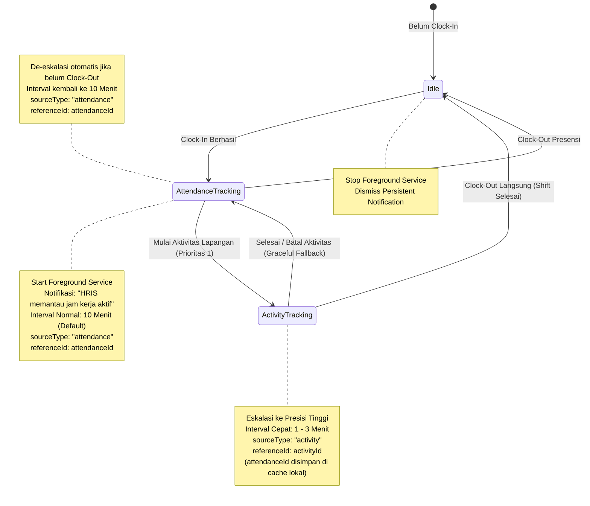

# 📍 Panduan Arsitektur Pelacakan Lokasi (Mobile GPS Tracking) — HRIS Flutter

Dokumen ini merupakan panduan teknis resmi bagi pengembang Flutter (`hris_flutter`) dalam mengimplementasikan layanan pelacakan lokasi (*Background & Foreground Location Tracking*), manajemen sensor GPS, penyimpanan buffer offline, serta aturan resolusi prioritas transmisi saat sesi **Presensi Harian** dan **Aktivitas Dinas Lapangan** berjalan bersamaan.

---

## 📋 Daftar Isi

1. [Ikhtisar Arsitektur Pelacakan Mobile](#1-ikhtisar-arsitektur-pelacakan-mobile)
2. [Resolusi Prioritas Ganda & Konteks Presensi (Dual Active Tracking Priority)](#2-resolusi-prioritas-ganda--konteks-presensi-dual-active-tracking-priority)
   - [Aturan Presedensi Utama (Activity > Attendance)](#21-aturan-presedensi-utama-activity--attendance)
   - [Pelestarian Konteks Presensi (Dual Context)](#22-pelestarian-konteks-presensi-dual-context)
   - [Transisi Otomatis & Pemulihan (Graceful Fallback Mechanism)](#23-transisi-otomatis--pemulihan-graceful-fallback-mechanism)
   - [Penghentian Total Pelacakan (Full Stop)](#24-penghentian-total-pelacakan-full-stop)
3. [Siklus Hidup Layanan Latar Belakang (Mobile Service Lifecycle)](#3-siklus-hidup-layanan-latar-belakang-mobile-service-lifecycle)
   - [Android Foreground Service & Sticky Notification](#31-android-foreground-service--sticky-notification)
   - [iOS Background Location & CoreLocation](#32-ios-background-location--corelocation)
   - [State Machine Layanan Mobile](#33-state-machine-layanan-mobile)
4. [Kontrak Data & Format Ingestion Batch (`POST /tracking/batch`)](#4-kontrak-data--format-ingestion-batch-post-trackingbatch)
5. [Mekanisme Offline Buffering & Resiliensi Jaringan](#5-mekanisme-offline-buffering--resiliensi-jaringan)
6. [Deteksi Fake GPS & Integritas Sensor (Anti-Mock Provider)](#6-deteksi-fake-gps--integritas-sensor-anti-mock-provider)
7. [Optimasi Daya Baterai & Sensor Throttling](#7-optimasi-daya-baterai--sensor-throttling)
8. [Kepatuhan Privasi Karyawan (UU PDP No. 27/2022)](#8-kepatuhan-privasi-karyawan-uu-pdp-no-272022)
9. [Panduan Integrasi Layer Kode & State Management (BLoC)](#9-panduan-integrasi-layer-kode--state-management-bloc)

---

## 1. Ikhtisar Arsitektur Pelacakan Mobile

Di aplikasi mobile `hris_flutter`, pelacakan lokasi berjalan di tingkat sistem operasi (*OS-level background task*) menggunakan kombinasi **Android Foreground Service** dan **iOS Background Processing Service**.

```text
┌────────────────────────────────────────────────────────────────────────┐
│                        hris_flutter (Mobile App)                       │
├────────────────────────────────────────────────────────────────────────┤
│ 1. SENSOR GPS & NETWORK POSITIONING                                    │
│    • Geolocator / Background Location Service                          │
│    • Periodic Heartbeat / Distance Filter Trigger                      │
│                                                                        │
│ 2. TRACKING COORDINATOR / SERVICE MANAGER                              │
│    • Mengevaluasi State: Idle | Attendance Active | Activity Active    │
│    • Menyesuaikan Interval: Normal (10m) vs Presisi Tinggi (1-3m)      │
│    • Menetapkan Metadata: sourceType, referenceId, isMock, battery     │
│                                                                        │
│ 3. LOCAL BUFFER & OFFLINE QUEUE (SQLite / Hive Storage)                │
│    • Simpan titik ke database lokal jika perangkat offline             │
│    • Flushing batch otomatis saat jaringan internet tersambung kembali │
└───────────────────────────────────┬────────────────────────────────────┘
                                    │ HTTP POST (Batch Coordinates)
                                    ▼
┌────────────────────────────────────────────────────────────────────────┐
│            muratech_hris_server / Ingest API (/tracking/batch)         │
└────────────────────────────────────────────────────────────────────────┘
```

### Syarat Fitur & Perizinan Sistem (Permissions)
1. **Android**:
   - `ACCESS_FINE_LOCATION` & `ACCESS_COARSE_LOCATION`
   - `ACCESS_BACKGROUND_LOCATION` (Android 10+ / API 29+)
   - `FOREGROUND_SERVICE_LOCATION` (Android 14+ / API 34)
   - `POST_NOTIFICATIONS` (Android 13+ / API 33)
2. **iOS**:
   - `NSLocationWhenInUseUsageDescription`
   - `NSLocationAlwaysAndWhenInUseUsageDescription`
   - UIBackgroundModes: `location` & `fetch`

---

## 2. Resolusi Prioritas Ganda & Konteks Presensi (Dual Active Tracking Priority)

Kasus paling sering terjadi di lapangan adalah: **Karyawan telah melakukan Clock-In (masuk kerja harian di kantor), kemudian memulai Aktivitas Lapangan (misal: kunjungan klien, dinas proyek, atau maintenance lapangan).**

Kedua sesi ini sama-sama memerlukan tracking, namun memiliki karakteristik frekuensi dan urgensi yang berbeda.



### 2.1. Aturan Presedensi Utama (`Activity > Attendance`)
- **Aktivitas Lapangan mengambil kendali transmisi utama**. Pemetaan perjalanan dinas membutuhkan interval lebih rapat (default **3 menit**, atau 1, 5 menit) dibandingkan jam kerja harian normal (default **10 menit**).
- Saat aktivitas dimulai (`POST /activity/{id}/start` berhasil):
  1. Service pelacakan menaikkan frekuensi sensor GPS ke `activityIntervalMinutes`.
  2. Nilai `sourceType` dalam payload koordinat diubah dari `"attendance"` menjadi `"activity"`.
  3. `referenceId` diubah menjadi `activityId`.

### 2.2. Pelestarian Konteks Presensi (*Dual Context*)
- Aplikasi mobile **tidak boleh menghapus** `attendanceId` yang sedang aktif ketika aktivitas dinas dimulai.
- ID sesi presensi (`activeAttendanceId`) wajib disimpan di secure local state / memory service. Hal ini memastikan mobile app sewaktu-waktu dapat melakukan fallback tanpa perlu menembak ulang API profil presensi.

### 2.3. Transisi Otomatis & Pemulihan (*Graceful Fallback Mechanism*)
- Ketika karyawan menyelesaikan tugas dinas (`POST /activity/{id}/finish`) atau membatalkannya (`POST /activity/{id}/cancel`):
  1. Service memeriksa apakah karyawan masih berada dalam shift kerja aktif (`activeAttendanceId != null` dan belum Clock-Out).
  2. Jika **masih aktif**:
     - Service **TIDAK DIHENTIKAN**.
     - Interval pelacakan otomatis diturunkan kembali (*de-escalated*) ke frekuensi presensi normal (`trackingIntervalMinutes`, misal 10 menit).
     - Payload pengiriman koordinat berikutnya otomatis beralih kembali:
       - `sourceType: "attendance"`
       - `referenceId: activeAttendanceId`
     - Teks pada *persistent notification* di-update kembali ke status jam kerja reguler.
  3. Jika **tidak ada shift presensi aktif**:
     - Service pelacakan dimatikan sepenuhnya.

### 2.4. Penghentian Total Pelacakan (*Full Stop*)
- Pelacakan latar belakang berhenti total hanya jika:
  - Karyawan melakukan **Clock-Out** (`POST /attendance/check-out`), **DAN**
  - Tidak ada aktivitas dinas lain yang berstatus *ongoing*.
- Semua timer periodic di-*cancel*, *foreground service* distop, dan notifikasi persisten dihilangkan dari status bar ponsel.

---

## 3. Siklus Hidup Layanan Latar Belakang (Mobile Service Lifecycle)

### 3.1. Android Foreground Service & Sticky Notification
Sesuai panduan Google Play Console dan Android 14 Policy, pelacakan latar belakang untuk aplikasi enterprise wajib menggunakan **Foreground Service dengan tipe `location`**:
- **Notifikasi Wajib (Persistent)**:
  - `channelId`: `hris_location_tracking_channel`
  - `channelName`: `Pelacakan Lokasi Kerja Aktif`
  - `importance`: `Importance.low` (agar tidak mengeluarkan suara/getar setiap menit).
  - `ongoing`: `true` (tidak dapat di-swipe hapus oleh karyawan selama jam kerja berlangsung).
  - Teks Dinamis:
    - Saat Presensi Harian: *"HRIS memantau lokasi kerja aktif Anda"*
    - Saat Aktivitas Dinas: *"HRIS memantau rute dinas: [Nama Aktivitas / Kunjungan]"*

### 3.2. iOS Background Location & CoreLocation
- Mengaktifkan `location` background mode pada `Info.plist`.
- Menggunakan `showsBackgroundLocationIndicator = true` (menampilkan kapsul biru / indikator lokasi aktif di status bar iOS).
- Konfigurasi `pausesLocationUpdatesAutomatically = false` selama jam kerja berlangsung.

### 3.3. State Machine Layanan Mobile

| State Aplikasi | Trigger Event | Status Service | Interval GPS | Tagging `sourceType` |
|---|---|:---:|:---:|:---:|
| **IDLE** | Belum Clock-In / Sudah Clock-Out | ⏹️ Mati | - | - |
| **IN_ATTENDANCE** | Clock-In Berhasil | ▶️ Berjalan | 10 Menit | `"attendance"` |
| **ON_ACTIVITY** | Aktivitas Dimulai | ⚡ Berjalan (High-Precision) | 1 - 3 Menit | `"activity"` |
| **FALLBACK** | Aktivitas Selesai, Belum Clock-Out | 🔄 Berjalan (Normal) | 10 Menit | `"attendance"` |

---

## 4. Kontrak Data & Format Ingestion Batch (`POST /tracking/batch`)

Mobile client mengumpulkan koordinat secara periodik lalu mengirimkannya dalam satu payload batch ke server:

### Endpoint
`POST /api/v1/tracking/batch` *(atau endpoint ingestion server yang ditentukan di `api_endpoints.dart`)*

### Header
```http
Authorization: Bearer <user_jwt_token>
Content-Type: application/json
```

### JSON Body Schema
```json
{
  "sourceType": "activity",
  "referenceId": "0f63b469-ca3b-4835-bd85-e627f1c1f7a0",
  "employeeId": "1a2b3c4d-5e6f-7a8b-9c0d-1e2f3a4b5c6d",
  "locations": [
    {
      "latitude": -6.2087634,
      "longitude": 106.845599,
      "accuracy": 8.5,
      "speed": 6.8,
      "heading": 180.0,
      "altitude": 24.0,
      "batteryLevel": 85,
      "isMock": false,
      "recordedAt": "2026-10-07T08:15:00.000Z"
    },
    {
      "latitude": -6.2112345,
      "longitude": 106.848912,
      "accuracy": 10.2,
      "speed": 8.1,
      "heading": 165.5,
      "altitude": 25.5,
      "batteryLevel": 84,
      "isMock": false,
      "recordedAt": "2026-10-07T08:18:00.000Z"
    }
  ]
}
```

### Keterangan Field Titik Koordinat:
| Field | Tipe | Keterangan |
|---|---|---|
| `latitude` | `double` | Derajat lintang (-90.0 s/d 90.0) |
| `longitude` | `double` | Derajat bujur (-180.0 s/d 180.0) |
| `accuracy` | `double` | Radius akurasi GPS dalam satuan meter |
| `speed` | `double?` | Kecepatan gerak (meter per detik / m/s) |
| `heading` | `double?` | Arah hadap kompas (0.0 s/d 360.0 derajat) |
| `altitude` | `double?` | Ketinggian dari permukaan laut (meter) |
| `batteryLevel` | `int?` | Sisa persentase daya baterai ponsel (0 - 100) |
| `isMock` | `bool` | `true` jika terdeteksi Fake GPS / mock provider |
| `recordedAt` | `String (ISO 8601)` | Waktu titik koordinat ditangkap oleh sensor HP |

---

## 5. Mekanisme Offline Buffering & Resiliensi Jaringan

Karyawan lapangan seringkali melintasi area dengan kualitas sinyal buruk (*dead-zone / blank spot*). Aplikasi mobile harus menjamin tidak ada riwayat rute yang hilang:

1. **Local Persistent Storage**:
   Setiap kali sensor GPS merekam titik baru, titik tersebut disimpan ke tabel antrean lokal (SQLite / Hive / Isar).
2. **Batch Upload**:
   Secara periodik, service mengambil seluruh titik di antrean lokal (maksimal 50 titik per batch) dan mencoba melakukan transmisi via HTTP POST.
3. **Pembersihan Antrean (Purge on 200 OK)**:
   Hanya titik-titik yang sukses diakui oleh server (HTTP status `200` atau `201`) yang dihapus dari database lokal.
4. **Retry dengan Exponential Backoff**:
   Jika request gagal karena jaringan putus (`SocketException` / `TimeoutException`), pengiriman ditunda secara bertahap (15s, 30s, 60s, hingga maksimal 5 menit) tanpa menghentikan perekaman sensor di latar belakang.

---

## 6. Deteksi Fake GPS & Integritas Sensor (Anti-Mock Provider)

Untuk menjaga kejujuran dan validitas data operasional, sistem mewajibkan audit fake GPS:
- **Di Android**:
  - Gunakan `location.isMock` (tersedia secara native di Android 12+ / API 31+) atau `location.isFromMockProvider()` untuk versi Android lama.
  - Periksa apakah opsi pengembang (*Developer Options*) mengaktifkan aplikasi *Mock Location App*.
- **Di iOS**:
  - Periksa integritas sensor melalui `CLLocation.sourceInformation.isSimulatedBySoftware`.
- **Kebijakan Pengiriman**:
  - Jika terdeteksi Fake GPS, titik koordinat **tetap dikirimkan** ke server dengan flag **`isMock: true`**.
  - Server dan web dashboard akan otomatis menandai titik tersebut dengan badge peringatan merah di peta admin tanpa membuat aplikasi mobile langsung crash.

---

## 7. Optimasi Daya Baterai & Sensor Throttling

Agar baterai ponsel karyawan dapat bertahan selama 8-9 jam jam kerja:
1. **Significant Distance Filter**:
   - Jika kecepatan (`speed`) bernilai `0` atau `< 1 m/s` dan perpindahan jarak dari titik terakhir `< 20 meter` selama lebih dari 10 menit (karyawan diam di meja kerja), tunda penambahan titik baru ke antrean untuk menghemat daya baterai.
2. **Location Accuracy Selection**:
   - Mode Presensi Harian: Gunakan `LocationAccuracy.balanced` atau `medium` (menghemat konsumsi chip GPS).
   - Mode Aktivitas Lapangan: Gunakan `LocationAccuracy.high` (memaksimalkan presisi jalur jalan raya).

---

## 8. Kepatuhan Privasi Karyawan (UU PDP No. 27/2022)

Sesuai Undang-Undang Perlindungan Data Pribadi (UU PDP):
1. **Pemberitahuan Transparan**: Karyawan harus selalu mengetahui kapan perangkatnya sedang dilacak melalui notifikasi persisten yang tidak dapat disembunyikan (*non-dismissible notification*).
2. **Batas Wilayah Waktu (Strict Time Boundary)**:
   - Pelacakan **dilarang keras** berjalan di luar jam kerja (sebelum Clock-In atau setelah Clock-Out).
   - Begitu tombol Clock-Out ditekan, service pelacakan wajib langsung menghentikan akuisisi lokasi dan menghapus semua listener sensor GPS.

---

## 9. Panduan Integrasi Layer Kode & State Management (BLoC)

Struktur implementasi pelacakan direkomendasikan berada di:

```text
lib/
├── core/
│   └── services/
│       ├── location/
│       │   ├── location_service.dart              # Abstraksi sensor GPS & Fake GPS check
│       │   ├── location_background_service.dart   # Foreground service Android / iOS lifecycle
│       │   └── location_local_storage.dart        # Offline buffering SQLite/Hive
├── features/
│   ├── attendance/
│   │   └── presentation/bloc/live_attendance/    # Trigger start/stop saat Clock-In & Clock-Out
│   └── activity/
│       └── presentation/bloc/activity_detail/    # Trigger eskalasi & de-eskalasi saat tugas dinas
```

### Snippet Event Koordinasi di BLoC

```dart
// 1. Saat Clock-In Berhasil
LocationBackgroundService.instance.startAttendanceTracking(
  attendanceId: attendance.id,
  intervalMinutes: companySetting.trackingIntervalMinutes ?? 10,
);

// 2. Saat Memulai Aktivitas Dinas Lapangan (Prioritas 1)
LocationBackgroundService.instance.elevateToActivityTracking(
  activityId: activity.id,
  activityTitle: activity.title,
  intervalMinutes: companySetting.activityIntervalMinutes ?? 3,
);

// 3. Saat Aktivitas Selesai (Graceful Fallback)
LocationBackgroundService.instance.fallbackToAttendanceTracking();

// 4. Saat Clock-Out Berhasil (Full Stop)
LocationBackgroundService.instance.stopAllTracking();
```
