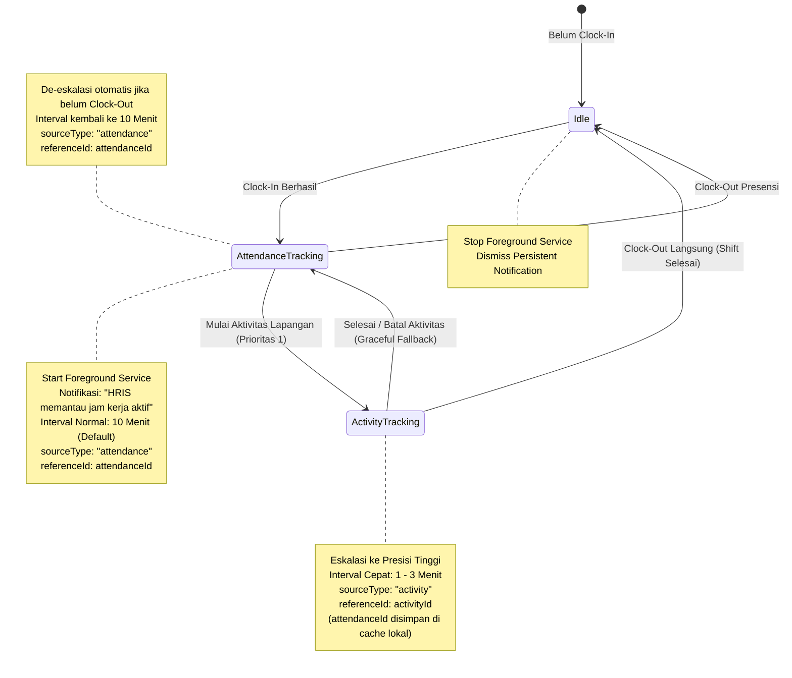

# 📍 Panduan Arsitektur Pelacakan Lokasi (Mobile GPS Tracking) — HRIS Flutter

Dokumen ini merupakan panduan teknis resmi bagi pengembang Flutter (`hris_flutter`) dan AI Coding Agent dalam mengimplementasikan layanan pelacakan lokasi (*Background & Foreground Location Tracking*), manajemen sensor GPS, penyimpanan buffer offline, aturan resolusi prioritas transmisi saat sesi **Presensi Harian** dan **Aktivitas Dinas Lapangan** berjalan bersamaan, serta kontrak API backend secara menyeluruh.

---

## 📋 Daftar Isi

1. [Ikhtisar Arsitektur Pelacakan Mobile](#1-ikhtisar-arsitektur-pelacakan-mobile)
2. [Resolusi Prioritas Ganda & Konteks Presensi (Dual Active Tracking Priority)](#2-resolusi-prioritas-ganda--konteks-presensi-dual-active-tracking-priority)
   - [Aturan Presedensi Utama (Activity > Attendance)](#21-aturan-presedensi-utama-activity--attendance)
   - [Pelestarian Konteks Presensi (Dual Context)](#22-pelestarian-konteks-presensi-dual-context)
   - [Transisi Otomatis & Pemulihan (Graceful Fallback Mechanism)](#23-transisi-otomatis--pemulihan-graceful-fallback-mechanism)
   - [Penghentian Total Pelacakan (Full Stop)](#24-penghentian-total-pelacakan-full-stop)
3. [Siklus Hidup Layanan Latar Belakang (Mobile Service Lifecycle)](#3-siklus-hidup-layanan-latar-belakang-mobile-service-lifecycle)
   - [Android Foreground Service & Sticky Notification](#31-android-foreground-service--sticky-notification)
   - [iOS Background Location & CoreLocation](#32-ios-background-location--corelocation)
   - [State Machine Layanan Mobile](#33-state-machine-layanan-mobile)
4. [Spesifikasi Lengkap API Pelacakan Lokasi (Server Endpoints & Contract)](#4-spesifikasi-lengkap-api-pelacakan-lokasi-server-endpoints--contract)
   - [Ringkasan Endpoint & Pemetaan ApiEndpoints](#41-ringkasan-endpoint--pemetaan-apiendpoints)
   - [GET /tracking/config — Konfigurasi Policy & Deteksi Sesi Aktif](#42-get-trackingconfig--konfigurasi-policy--deteksi-sesi-aktif)
   - [POST /tracking/batch — Ingestion Batch Titik Koordinat GPS](#43-post-trackingbatch--ingestion-batch-titik-koordinat-gps)
   - [Protokol Penanganan Error Kritis & Status SESSION_CLOSED](#44-protokol-penanganan-error-kritis--status-session_closed)
   - [GET /tracking/logs — Riwayat Jejak Rute GPS (Polyline Route)](#45-get-trackinglogs--riwayat-jejak-rute-gps-polyline-route)
   - [GET /tracking/live — Live Tracking Dispatcher (Monitoring Karyawan)](#46-get-trackinglive--live-tracking-dispatcher-monitoring-karyawan)
5. [Mekanisme Offline Buffering & Resiliensi Jaringan](#5-mekanisme-offline-buffering--resiliensi-jaringan)
6. [Deteksi Fake GPS & Integritas Sensor (Anti-Mock Provider)](#6-deteksi-fake-gps--integritas-sensor-anti-mock-provider)
7. [Optimasi Daya Baterai & Sensor Throttling](#7-optimasi-daya-baterai--sensor-throttling)
8. [Kepatuhan Privasi Karyawan (UU PDP No. 27/2022)](#8-kepatuhan-privasi-karyawan-uu-pdp-no-272022)
9. [Panduan Integrasi Layer Kode, Model DTO & State Management (BLoC)](#9-panduan-integrasi-layer-kode-model-dto--state-management-bloc)
   - [Data Transfer Objects (Dart Models)](#91-data-transfer-objects-dart-models)
   - [Remote Data Source & Dio Error Interception](#92-remote-data-source--dio-error-interception)
   - [Snippet Event Koordinasi di BLoC](#93-snippet-event-koordinasi-di-bloc)

---

## 1. Ikhtisar Arsitektur Pelacakan Mobile

Di aplikasi mobile `hris_flutter`, pelacakan lokasi berjalan di tingkat sistem operasi (*OS-level background task*) menggunakan kombinasi **Android Foreground Service** dan **iOS Background Processing Service**.

```text
┌────────────────────────────────────────────────────────────────────────┐
│                        hris_flutter (Mobile App)                       │
├────────────────────────────────────────────────────────────────────────┤
│ 1. SENSOR GPS & NETWORK POSITIONING                                    │
│    • Geolocator / Background Location Service                          │
│    • Periodic Heartbeat / Distance Filter Trigger                      │
│                                                                        │
│ 2. TRACKING COORDINATOR / SERVICE MANAGER                              │
│    • Mengevaluasi State: Idle | Attendance Active | Activity Active    │
│    • Menyesuaikan Interval: Normal (10m) vs Presisi Tinggi (1-3m)      │
│    • Menetapkan Metadata: sourceType, referenceId, isMock, battery     │
│                                                                        │
│ 3. LOCAL BUFFER & OFFLINE QUEUE (SQLite / Hive Storage)                │
│    • Simpan titik ke database lokal jika perangkat offline             │
│    • Flushing batch otomatis saat jaringan internet tersambung kembali │
└───────────────────────────────────┬────────────────────────────────────┘
                                    │ HTTP POST (Batch Coordinates)
                                    ▼
┌────────────────────────────────────────────────────────────────────────┐
│            muratech_hris_server / Ingest API (/tracking/batch)         │
└────────────────────────────────────────────────────────────────────────┘
```

### Syarat Fitur & Perizinan Sistem (Permissions)
1. **Android**:
   - `ACCESS_FINE_LOCATION` & `ACCESS_COARSE_LOCATION`
   - `ACCESS_BACKGROUND_LOCATION` (Android 10+ / API 29+)
   - `FOREGROUND_SERVICE_LOCATION` (Android 14+ / API 34)
   - `POST_NOTIFICATIONS` (Android 13+ / API 33)
2. **iOS**:
   - `NSLocationWhenInUseUsageDescription`
   - `NSLocationAlwaysAndWhenInUseUsageDescription`
   - UIBackgroundModes: `location` & `fetch`

---

## 2. Resolusi Prioritas Ganda & Konteks Presensi (Dual Active Tracking Priority)

Kasus paling sering terjadi di lapangan adalah: **Karyawan telah melakukan Clock-In (masuk kerja harian di kantor), kemudian memulai Aktivitas Lapangan (misal: kunjungan klien, dinas proyek, atau maintenance lapangan).**

Kedua sesi ini sama-sama memerlukan tracking, namun memiliki karakteristik frekuensi dan urgensi yang berbeda.



### 2.1. Aturan Presedensi Utama (`Activity > Attendance`)
- **Aktivitas Lapangan mengambil kendali transmisi utama**. Pemetaan perjalanan dinas membutuhkan interval lebih rapat (default **3 menit**, atau 1–5 menit) dibandingkan jam kerja harian normal (default **10 menit**).
- Saat aktivitas dimulai (`POST /activity/{id}/start` berhasil):
  1. Service pelacakan menaikkan frekuensi sensor GPS ke `activityIntervalMinutes`.
  2. Nilai `sourceType` dalam payload koordinat diubah dari `"attendance"` menjadi `"activity"`.
  3. `referenceId` diubah menjadi `activityId`.

### 2.2. Pelestarian Konteks Presensi (*Dual Context*)
- Aplikasi mobile **tidak boleh menghapus** `attendanceId` yang sedang aktif ketika aktivitas dinas dimulai.
- ID sesi presensi (`activeAttendanceId`) wajib disimpan di secure local state / memory service. Hal ini memastikan mobile app sewaktu-waktu dapat melakukan fallback tanpa perlu menembak ulang API profil presensi.

### 2.3. Transisi Otomatis & Pemulihan (*Graceful Fallback Mechanism*)
- Ketika karyawan menyelesaikan tugas dinas (`POST /activity/{id}/finish`) atau membatalkannya (`POST /activity/{id}/cancel`):
  1. Service memeriksa apakah karyawan masih berada dalam shift kerja aktif (`activeAttendanceId != null` dan belum Clock-Out).
  2. Jika **masih aktif**:
     - Service **TIDAK DIHENTIKAN**.
     - Interval pelacakan otomatis diturunkan kembali (*de-escalated*) ke frekuensi presensi normal (`trackingIntervalMinutes`, misal 10 menit).
     - Payload pengiriman koordinat berikutnya otomatis beralih kembali:
       - `sourceType: "attendance"`
       - `referenceId: activeAttendanceId`
     - Teks pada *persistent notification* di-update kembali ke status jam kerja reguler.
  3. Jika **tidak ada shift presensi aktif**:
     - Service pelacakan dimatikan sepenuhnya.

### 2.4. Penghentian Total Pelacakan (*Full Stop*)
- Pelacakan latar belakang berhenti total hanya jika:
  - Karyawan melakukan **Clock-Out** (`POST /attendance/check-out`), **DAN**
  - Tidak ada aktivitas dinas lain yang berstatus *ongoing*.
- Semua timer periodic di-*cancel*, *foreground service* distop, dan notifikasi persisten dihilangkan dari status bar ponsel.

---

## 3. Siklus Hidup Layanan Latar Belakang (Mobile Service Lifecycle)

### 3.1. Android Foreground Service & Sticky Notification
Sesuai panduan Google Play Console dan Android 14 Policy, pelacakan latar belakang untuk aplikasi enterprise wajib menggunakan **Foreground Service dengan tipe `location`**:
- **Notifikasi Wajib (Persistent)**:
  - `channelId`: `hris_location_tracking_channel`
  - `channelName`: `Pelacakan Lokasi Kerja Aktif`
  - `importance`: `Importance.low` (agar tidak mengeluarkan suara/getar setiap menit).
  - `ongoing`: `true` (tidak dapat di-swipe hapus oleh karyawan selama jam kerja berlangsung).
  - Teks Dinamis:
    - Saat Presensi Harian: *"HRIS memantau lokasi kerja aktif Anda"*
    - Saat Aktivitas Dinas: *"HRIS memantau rute dinas: [Nama Aktivitas / Kunjungan]"*

### 3.2. iOS Background Location & CoreLocation
- Mengaktifkan `location` background mode pada `Info.plist`.
- Menggunakan `showsBackgroundLocationIndicator = true` (menampilkan kapsul biru / indikator lokasi aktif di status bar iOS).
- Konfigurasi `pausesLocationUpdatesAutomatically = false` selama jam kerja berlangsung.

### 3.3. State Machine Layanan Mobile

| State Aplikasi | Trigger Event | Status Service | Interval GPS | Tagging `sourceType` |
|---|---|:---:|:---:|:---:|
| **IDLE** | Belum Clock-In / Sudah Clock-Out | ⏹️ Mati | - | - |
| **IN_ATTENDANCE** | Clock-In Berhasil | ▶️ Berjalan | 10 Menit | `"attendance"` |
| **ON_ACTIVITY** | Aktivitas Dimulai | ⚡ Berjalan (High-Precision) | 1 - 3 Menit | `"activity"` |
| **FALLBACK** | Aktivitas Selesai, Belum Clock-Out | 🔄 Berjalan (Normal) | 10 Menit | `"attendance"` |

---

## 4. Spesifikasi Lengkap API Pelacakan Lokasi (Server Endpoints & Contract)

Bagian ini mendokumentasikan seluruh kontrak antarmuka API antara aplikasi mobile `hris_flutter` dan backend `muratech_hris_server`. Seluruh endpoint dilindungi oleh `authMiddleware` dan menggunakan prefix Base URL API (`/api/v1`).

### 4.1. Ringkasan Endpoint & Pemetaan ApiEndpoints

Semua endpoint telah dipetakan secara terpusat pada file [`lib/core/constants/api_endpoints.dart`](file:///d:/Belajar/Flutter/hris_flutter/lib/core/constants/api_endpoints.dart):

| Konstanta `ApiEndpoints` | Method | Path Lengkap | Deskripsi & Target Pengguna |
|---|:---:|---|---|
| `ApiEndpoints.trackingConfig` | `GET` | `/api/v1/tracking/config` | Cek policy tenant & deteksi sesi aktif (Mobile Client) |
| `ApiEndpoints.trackingBatch` | `POST` | `/api/v1/tracking/batch` | Ingestion batch koordinat GPS (Mobile Background Task) |
| `ApiEndpoints.trackingLogs` | `GET` | `/api/v1/tracking/logs` | Riwayat koordinat rute polyline (Mobile & Web Map) |
| `ApiEndpoints.trackingLive` | `GET` | `/api/v1/tracking/live` | Lokasi terkini armada karyawan (Supervisor / Admin) |

---

### 4.2. GET `/tracking/config` — Konfigurasi Policy & Deteksi Sesi Aktif

Dipanggil oleh mobile client saat:
1. Inisialisasi awal aplikasi (saat pengguna berhasil login atau aplikasi dibuka kembali).
2. Sebelum memulai foreground service GPS untuk memvalidasi apakah perusahaan mengaktifkan fitur pelacakan dan berapa interval pengambilan titik koordinat yang ditetapkan.
3. Mendeteksi sesi presensi atau aktivitas yang tertinggal jika aplikasi sempat dihentikan secara paksa (*app kill / restart*).

#### Header Request
```http
Authorization: Bearer <user_jwt_token>
Accept: application/json
```

#### Response Sukses (`200 OK`)
```json
{
  "success": true,
  "data": {
    "hasAccess": true,
    "isTrackingEnabled": true,
    "attendance": {
      "enabled": true,
      "intervalMinutes": 10,
      "activeAttendanceId": "0f63b469-ca3b-4835-bd85-e627f1c1f7a0"
    },
    "activity": {
      "enabled": true,
      "intervalMinutes": 3,
      "activeActivityId": null
    }
  }
}
```

#### Penjelasan Field Response:
| Field | Tipe | Keterangan |
|---|---|---|
| `hasAccess` | `bool` | Status lisensi paket langganan tenant (hanya aktif untuk paket **Enterprise** atau tenant dengan kontrak override pelacakan). Jika `false`, aplikasi mobile **dilarang menyalakan GPS service**. |
| `isTrackingEnabled` | `bool` | *Master switch* pelacakan tingkat perusahaan. Dihitung dari `hasAccess && companySetting.isTrackingEnabled`. |
| `attendance.enabled` | `bool` | Apakah pelacakan jam kerja harian presensi aktif untuk perusahaan ini. |
| `attendance.intervalMinutes`| `int` | Interval frekuensi perekaman sensor GPS saat sesi presensi harian (default: `10` menit). |
| `attendance.activeAttendanceId` | `String?` | ID presensi yang sedang berlangsung (belum Clock-Out). Bernilai `null` jika karyawan sedang tidak bertugas. |
| `activity.enabled` | `bool` | Apakah pelacakan rute perjalanan dinas / tugas lapangan aktif. |
| `activity.intervalMinutes` | `int` | Interval frekuensi perekaman sensor GPS saat tugas dinas (default: `3` menit). |
| `activity.activeActivityId` | `String?` | ID aktivitas dinas lapangan yang berstatus `ongoing`. Bernilai `null` jika tidak ada dinas aktif. |

---

### 4.3. POST `/tracking/batch` — Ingestion Batch Titik Koordinat GPS

Digunakan oleh background service mobile untuk mengirimkan kumpulan koordinat GPS secara periodik atau setelah perangkat kembali online dari area *dead-zone*.

#### Batasan & Proteksi Server:
- **Rate Limit**: Dilindungi oleh *rate limiter* khusus (`120 request / menit per IP`).
- **Autentikasi Otomatis**: Server mengidentifikasi identitas karyawan langsung dari token JWT (`AUTH_USER`). **Jangan menyertakan `employeeId` di body JSON**.
- **Database Upsert**: Server otomatis memperbarui data posisi terkini pada tabel `employee_current_locations` menggunakan titik koordinat dengan timestamp `recordedAt` paling mutakhir di dalam batch.

#### Header Request
```http
Authorization: Bearer <user_jwt_token>
Content-Type: application/json
Accept: application/json
```

#### JSON Request Body Schema
```json
{
  "sourceType": "activity",
  "referenceId": "0f63b469-ca3b-4835-bd85-e627f1c1f7a0",
  "locations": [
    {
      "latitude": -6.2087634,
      "longitude": 106.845599,
      "accuracy": 8.5,
      "speed": 6.8,
      "heading": 180.0,
      "altitude": 24.0,
      "batteryLevel": 85,
      "isMock": false,
      "recordedAt": "2026-10-07T08:15:00.000Z"
    },
    {
      "latitude": -6.2112345,
      "longitude": 106.848912,
      "accuracy": 10.2,
      "speed": 8.1,
      "heading": 165.5,
      "altitude": 25.5,
      "batteryLevel": 84,
      "isMock": false,
      "recordedAt": "2026-10-07T08:18:00.000Z"
    }
  ]
}
```

#### Keterangan Field Body:
| Field | Tipe | Wajib | Keterangan |
|---|---|:---:|---|
| `sourceType` | `String` | Ya | Tag asal pelacakan: `"attendance"` (presensi) atau `"activity"` (tugas dinas). |
| `referenceId` | `String (UUID)` | Ya | `attendanceId` jika `sourceType == "attendance"`, atau `activityId` jika `sourceType == "activity"`. |
| `locations` | `List<Map>` | Ya | Daftar koordinat GPS (minimal 1 titik, disarankan batch per 10–50 titik). |
| `locations[].latitude` | `double` | Ya | Lintang derajat (-90.0 s/d 90.0). |
| `locations[].longitude` | `double` | Ya | Bujur derajat (-180.0 s/d 180.0). |
| `locations[].accuracy` | `double?` | Opsional | Radius ketidakpastian akurasi sensor (dalam meter). |
| `locations[].speed` | `double?` | Opsional | Kecepatan perangkat saat bergerak (meter/detik). |
| `locations[].heading` | `double?` | Opsional | Arah kompas lintasan (0.0 s/d 360.0 derajat). |
| `locations[].altitude` | `double?` | Opsional | Ketinggian permukaan laut (meter). |
| `locations[].batteryLevel` | `int?` | Opsional | Sisa daya baterai perangkat saat titik dicatat (0–100). |
| `locations[].isMock` | `bool` | Opsional | Default `false`. Wajib diisi `true` jika terdeteksi Fake GPS / mock provider. |
| `locations[].recordedAt` | `String` | Ya | Format ISO-8601 UTC timestamp saat titik dicatat oleh sensor perangkat. |

#### Response Sukses (`201 Created`)
```json
{
  "success": true,
  "message": "Tracking logs stored successfully",
  "data": {
    "insertedCount": 2,
    "lastRecordedAt": "2026-10-07T08:18:00.000Z"
  }
}
```

---

### 4.4. Protokol Penanganan Error Kritis & Status `SESSION_CLOSED`

Aplikasi mobile **WAJIB** menangani respon kesalahan dari server sesuai protokol berikut agar tidak terjadi pemborosan kuota, penumpukan memori, atau *infinite retry loop*:

| HTTP Status | Pesan Server / Error Code | Root Cause | Tindakan Wajib Mobile Client / Agent |
|:---:|---|---|---|
| **`400 Bad Request`** | `"Attendance already clocked out. Stop tracking."`<br>`code: "SESSION_CLOSED"` | Sesi presensi karyawan telah ditutup (misalnya otomatis oleh sistem saat pergantian hari atau Clock-Out manual oleh admin). | **AUTO-KILL SESSION**: Hentikan segera background tracking untuk sesi presensi ini. Hapus semua antrean koordinat lokal dengan `referenceId` tersebut. Matikan foreground service jika tidak ada dinas aktif. |
| **`400 Bad Request`** | `"Activity is no longer ongoing."`<br>`code: "SESSION_CLOSED"` | Sesi dinas lapangan telah selesai (`finished`) atau dibatalkan (`cancelled`). | **AUTO-FALLBACK**: Hentikan tracking aktivitas dinas. Lakukan pengecekan apakah sesi presensi harian masih aktif. Jika aktif, turunkan frekuensi ke presensi reguler (*fallback*). Hapus antrean koordinat aktivitas ini. |
| **`400 Bad Request`** | `"Pelacakan lokasi dinonaktifkan oleh perusahaan"` | Administrator menonaktifkan fitur pelacakan di portal web. | Hentikan background service secara anggun (*graceful stop*). |
| **`403 Forbidden`** | `"Fitur pelacakan lokasi tidak tersedia pada paket langganan Anda"` | Paket langganan tenant tidak mencakup fitur lokasi. | Matikan background service, hapus antrean lokal, dan jangan lakukan pengulangan pengiriman (*do not retry*). |
| **`404 Not Found`** | `"Sesi presensi tidak ditemukan"` / `"Sesi aktivitas tidak ditemukan"` | ID sesi salah atau telah dihapus dari database. | Hapus antrean lokal terkait `referenceId` tersebut agar antrean tidak macet. |
| **`429 Too Many Requests`** | `"Too many requests, please try again later"` | Klien melebihi batas 120 req/menit. | Terapkan *exponential backoff* (tunda pengiriman batch berikutnya selama 30–60 detik). |
| **`5xx / Timeout / Offline`** | Kegagalan jaringan atau server tidak terjangkau. | Gangguan konektivitas seluler / *dead-zone*. | **TETAPKAN DALAM ANTREAN LOKAL**: Jangan hapus data. Tunggu hingga konektivitas kembali stabil lalu lakukan flushing otomatis. |

---

### 4.5. GET `/tracking/logs` — Riwayat Jejak Rute GPS (Polyline Route)

Digunakan untuk mengambil riwayat titik rute perjalanan guna merender garis lintasan (*polyline*) pada peta (Google Maps / Mapbox) di halaman riwayat presensi atau detail aktivitas lapangan.

#### Header Request
```http
Authorization: Bearer <user_jwt_token>
Accept: application/json
```

#### Query Parameters:
| Parameter | Tipe | Status | Keterangan |
|---|---|:---:|---|
| `sourceType` | `String` | Wajib | Filter sumber rute: `'attendance'` atau `'activity'`. |
| `referenceId` | `String (UUID)` | Wajib | ID presensi (`attendanceId`) atau ID aktivitas (`activityId`). |
| `employeeId` | `String (UUID)` | Opsional | ID karyawan. Jika diisi karyawan lain, memerlukan wewenang manajerial/HR (`canAccessEmployee`). Jika kosong, otomatis membaca data pengguna aktif. |
| `limit` | `int` | Opsional | Batas jumlah titik koordinat (maksimal `5000` titik). |

#### Response Sukses (`200 OK`)
```json
{
  "success": true,
  "message": "Tracking logs retrieved successfully",
  "data": [
    {
      "id": "7f1c1f7a-ca3b-4835-bd85-0f63b469ca3b",
      "employeeId": "1a2b3c4d-5e6f-7a8b-9c0d-1e2f3a4b5c6d",
      "sourceType": "activity",
      "attendanceId": null,
      "activityId": "0f63b469-ca3b-4835-bd85-e627f1c1f7a0",
      "latitude": -6.2087634,
      "longitude": 106.845599,
      "accuracy": 8.5,
      "speed": 6.8,
      "heading": 180.0,
      "altitude": 24.0,
      "batteryLevel": 85,
      "isMock": false,
      "recordedAt": "2026-10-07T08:15:00.000Z",
      "createdAt": "2026-10-07T08:15:10.000Z"
    }
  ]
}
```

---

### 4.6. GET `/tracking/live` — Live Tracking Dispatcher (Monitoring Karyawan)

Endpoint ini digunakan oleh aplikasi pengawas / supervisor / dashboard manajerial untuk memantau posisi geografis terakhir seluruh karyawan yang sedang bertugas secara realtime.

#### Hak Akses Khusus:
Memerlukan wewenang fungsional `report.live_tracking.view` (kecuali role Superadmin / `admin_system`).

#### Header Request
```http
Authorization: Bearer <user_jwt_token>
Accept: application/json
```

#### Query Parameters:
| Parameter | Tipe | Default | Keterangan |
|---|---|:---:|---|
| `companyId` | `String (UUID)` | Opsional | Filter perusahaan tertentu dalam tenant. |
| `departmentId` | `String (UUID)` | Opsional | Filter departemen kerja karyawan. |
| `status` | `String` | `'all'` | Opsi: `'all'`, `'attendance'`, atau `'activity'`. |
| `activeOnly` | `bool` | `true` | Hanya tampilkan karyawan yang memiliki sesi aktif. |
| `search` | `String` | Opsional | Pencarian teks berdasarkan nama karyawan atau nomor induk karyawan (NIK). |

#### Response Sukses (`200 OK`)
```json
{
  "success": true,
  "message": "Live tracking data retrieved successfully",
  "data": {
    "summary": {
      "totalTracked": 12,
      "attendanceCount": 8,
      "activityCount": 4,
      "onlineCount": 10
    },
    "employees": [
      {
        "employeeId": "1a2b3c4d-5e6f-7a8b-9c0d-1e2f3a4b5c6d",
        "name": "Budi Pratama",
        "employeeNumber": "EMP-2024-089",
        "photoUrl": "https://storage.hroasish.com/avatars/budi.jpg",
        "companyId": "c01-uuid",
        "companyName": "PT Muratech Presisi Indonesia",
        "department": { "id": "d01-uuid", "name": "Operasional Lapangan" },
        "position": { "id": "p01-uuid", "name": "Teknisi Senior" },
        "latitude": -6.2087634,
        "longitude": 106.845599,
        "accuracy": 8.5,
        "batteryLevel": 85,
        "status": "activity",
        "activeRefId": "act-uuid",
        "recordedAt": "2026-10-07T08:15:00.000Z",
        "updatedAt": "2026-10-07T08:15:10.000Z",
        "isOnline": true,
        "minutesSinceLastPing": 2,
        "session": {
          "type": "activity",
          "id": "act-uuid",
          "title": "Maintenance Mesin CNC Klien A",
          "startTime": "2026-10-07T08:00:00.000Z",
          "notes": "Pengecekan hidrolik berkala"
        }
      }
    ]
  }
}
```

> **Indikator Online / Offline**: Server menghitung `isOnline = minutesSinceLastPing <= 15`. Jika perangkat tidak mengirimkan koordinat lebih dari 15 menit (karena baterai habis atau di luar jangkauan sinyal), ikon pin lokasi di peta berubah menjadi status abu-abu (*offline*).

---

## 5. Mekanisme Offline Buffering & Resiliensi Jaringan

Karyawan lapangan seringkali melintasi area dengan kualitas sinyal buruk (*dead-zone / blank spot*). Aplikasi mobile harus menjamin tidak ada riwayat rute yang hilang:

1. **Local Persistent Storage**:
   Setiap kali sensor GPS merekam titik baru, titik tersebut disimpan ke tabel antrean lokal (SQLite / Hive / Isar).
2. **Batch Upload**:
   Secara periodik, service mengambil seluruh titik di antrean lokal (maksimal 50 titik per batch) dan mencoba melakukan transmisi via HTTP POST ke `ApiEndpoints.trackingBatch`.
3. **Pembersihan Antrean (Purge on 201 Created)**:
   Hanya titik-titik yang sukses diakui oleh server (HTTP status `200` atau `201`) yang dihapus dari database lokal.
4. **Retry dengan Exponential Backoff**:
   Jika request gagal karena jaringan putus (`SocketException` / `TimeoutException`), pengiriman ditunda secara bertahap (15s, 30s, 60s, hingga maksimal 5 menit) tanpa menghentikan perekaman sensor di latar belakang.
5. **Session Invalidation Purge**:
   Jika server merespons dengan `400 Bad Request` berkode `SESSION_CLOSED` atau `404 Not Found`, data antrean lokal untuk sesi tersebut harus segera dibersihkan agar tidak menghambat pengiriman sesi berikutnya.

---

## 6. Deteksi Fake GPS & Integritas Sensor (Anti-Mock Provider)

Untuk menjaga kejujuran dan validitas data operasional, sistem mewajibkan audit fake GPS:
- **Di Android**:
  - Gunakan `location.isMock` (tersedia secara native di Android 12+ / API 31+) atau `location.isFromMockProvider()` untuk versi Android lama.
  - Periksa apakah opsi pengembang (*Developer Options*) mengaktifkan aplikasi *Mock Location App*.
- **Di iOS**:
  - Periksa integritas sensor melalui `CLLocation.sourceInformation.isSimulatedBySoftware`.
- **Kebijakan Pengiriman**:
  - Jika terdeteksi Fake GPS, titik koordinat **tetap dikirimkan** ke server dengan flag **`isMock: true`**.
  - Server dan web dashboard akan otomatis menandai titik tersebut dengan badge peringatan merah di peta admin tanpa membuat aplikasi mobile langsung crash.

---

## 7. Optimasi Daya Baterai & Sensor Throttling

Agar baterai ponsel karyawan dapat bertahan selama 8–9 jam jam kerja:
1. **Significant Distance Filter**:
   - Jika kecepatan (`speed`) bernilai `0` atau `< 1 m/s` dan perpindahan jarak dari titik terakhir `< 20 meter` selama lebih dari 10 menit (karyawan diam di meja kerja), tunda penambahan titik baru ke antrean untuk menghemat daya baterai.
2. **Location Accuracy Selection**:
   - Mode Presensi Harian: Gunakan `LocationAccuracy.balanced` atau `medium` (menghemat konsumsi chip GPS).
   - Mode Aktivitas Lapangan: Gunakan `LocationAccuracy.high` (memaksimalkan presisi jalur jalan raya).

---

## 8. Kepatuhan Privasi Karyawan (UU PDP No. 27/2022)

Sesuai Undang-Undang Perlindungan Data Pribadi (UU PDP):
1. **Pemberitahuan Transparan**: Karyawan harus selalu mengetahui kapan perangkatnya sedang dilacak melalui notifikasi persisten yang tidak dapat disembunyikan (*non-dismissible notification*).
2. **Batas Wilayah Waktu (Strict Time Boundary)**:
   - Pelacakan **dilarang keras** berjalan di luar jam kerja (sebelum Clock-In atau setelah Clock-Out).
   - Begitu tombol Clock-Out ditekan, service pelacakan wajib langsung menghentikan akuisisi lokasi dan menghapus semua listener sensor GPS.

---

## 9. Panduan Integrasi Layer Kode, Model DTO & State Management (BLoC)

Struktur implementasi pelacakan direkomendasikan berada di:

```text
lib/
├── core/
│   ├── constants/
│   │   └── api_endpoints.dart                 # Konstanta endpoint /tracking/*
│   └── services/
│       ├── location/
│       │   ├── location_service.dart          # Abstraksi sensor GPS & Fake GPS check
│       │   ├── location_background_service.dart # Foreground service Android / iOS lifecycle
│       │   └── location_local_storage.dart    # Offline buffering SQLite/Hive
├── features/
│   ├── tracking/
│   │   ├── data/
│   │   │   ├── models/                        # DTO: TrackingConfigModel, TrackingBatchPayload
│   │   │   └── datasources/                   # TrackingRemoteDataSource (Dio)
│   │   └── domain/repositories/               # TrackingRepository
│   ├── attendance/
│   │   └── presentation/bloc/live_attendance/ # Trigger start/stop saat Clock-In & Clock-Out
│   └── activity/
│       └── presentation/bloc/activity_detail/ # Trigger eskalasi & de-eskalasi saat tugas dinas
```

### 9.1. Data Transfer Objects (Dart Models)

```dart
/// Model Konfigurasi Pelacakan dari GET /tracking/config
class TrackingConfigModel {
  final bool hasAccess;
  final bool isTrackingEnabled;
  final TrackingSessionPolicy attendance;
  final TrackingSessionPolicy activity;

  TrackingConfigModel({
    required this.hasAccess,
    required this.isTrackingEnabled,
    required this.attendance,
    required this.activity,
  });

  factory TrackingConfigModel.fromJson(Map<String, dynamic> json) {
    return TrackingConfigModel(
      hasAccess: json['hasAccess'] ?? false,
      isTrackingEnabled: json['isTrackingEnabled'] ?? false,
      attendance: TrackingSessionPolicy.fromJson(json['attendance'] ?? {}),
      activity: TrackingSessionPolicy.fromJson(json['activity'] ?? {}),
    );
  }
}

class TrackingSessionPolicy {
  final bool enabled;
  final int intervalMinutes;
  final String? activeSessionId;

  TrackingSessionPolicy({
    required this.enabled,
    required this.intervalMinutes,
    this.activeSessionId,
  });

  factory TrackingSessionPolicy.fromJson(Map<String, dynamic> json) {
    return TrackingSessionPolicy(
      enabled: json['enabled'] ?? false,
      intervalMinutes: json['intervalMinutes'] ?? 10,
      activeSessionId: json['activeAttendanceId'] ?? json['activeActivityId'],
    );
  }
}

/// Payload Batch Upload untuk POST /tracking/batch
class TrackingBatchPayload {
  final String sourceType; // 'attendance' | 'activity'
  final String referenceId;
  final List<TrackingLocationPoint> locations;

  TrackingBatchPayload({
    required this.sourceType,
    required this.referenceId,
    required this.locations,
  });

  Map<String, dynamic> toJson() => {
    'sourceType': sourceType,
    'referenceId': referenceId,
    'locations': locations.map((loc) => loc.toJson()).toList(),
  };
}

class TrackingLocationPoint {
  final double latitude;
  final double longitude;
  final double? accuracy;
  final double? speed;
  final double? heading;
  final double? altitude;
  final int? batteryLevel;
  final bool isMock;
  final DateTime recordedAt;

  TrackingLocationPoint({
    required this.latitude,
    required this.longitude,
    this.accuracy,
    this.speed,
    this.heading,
    this.altitude,
    this.batteryLevel,
    this.isMock = false,
    required this.recordedAt,
  });

  Map<String, dynamic> toJson() => {
    'latitude': latitude,
    'longitude': longitude,
    if (accuracy != null) 'accuracy': accuracy,
    if (speed != null) 'speed': speed,
    if (heading != null) 'heading': heading,
    if (altitude != null) 'altitude': altitude,
    if (batteryLevel != null) 'batteryLevel': batteryLevel,
    'isMock': isMock,
    'recordedAt': recordedAt.toUtc().toIso8601String(),
  };
}
```

### 9.2. Remote Data Source & Dio Error Interception

```dart
class TrackingRemoteDataSource {
  final Dio _dio;

  TrackingRemoteDataSource(this._dio);

  /// 1. Ambil Kebijakan Pelacakan & Sesi Aktif
  Future<TrackingConfigModel> getTrackingConfig() async {
    final response = await _dio.get(ApiEndpoints.trackingConfig);
    return TrackingConfigModel.fromJson(response.data['data']);
  }

  /// 2. Batch Upload dengan Deteksi SESSION_CLOSED
  Future<void> uploadBatch(TrackingBatchPayload payload) async {
    try {
      await _dio.post(
        ApiEndpoints.trackingBatch,
        data: payload.toJson(),
      );
    } on DioException catch (e) {
      final responseData = e.response?.data;
      final errorCode = responseData is Map ? responseData['code'] : null;

      // Handle khusus jika sesi telah ditutup di server
      if (e.response?.statusCode == 400 && errorCode == 'SESSION_CLOSED') {
        throw SessionClosedException(
          message: responseData['message'] ?? 'Sesi telah ditutup.',
          sourceType: payload.sourceType,
          referenceId: payload.referenceId,
        );
      }
      rethrow;
    }
  }
}

class SessionClosedException implements Exception {
  final String message;
  final String sourceType;
  final String referenceId;

  SessionClosedException({
    required this.message,
    required this.sourceType,
    required this.referenceId,
  });

  @override
  String toString() => 'SessionClosedException: $message ($sourceType: $referenceId)';
}
```

### 9.3. Snippet Event Koordinasi di BLoC

```dart
// 1. Saat Clock-In Berhasil
LocationBackgroundService.instance.startAttendanceTracking(
  attendanceId: attendance.id,
  intervalMinutes: companySetting.trackingIntervalMinutes ?? 10,
);

// 2. Saat Memulai Aktivitas Dinas Lapangan (Prioritas 1)
LocationBackgroundService.instance.elevateToActivityTracking(
  activityId: activity.id,
  activityTitle: activity.title,
  intervalMinutes: companySetting.activityIntervalMinutes ?? 3,
);

// 3. Saat Aktivitas Selesai (Graceful Fallback)
LocationBackgroundService.instance.fallbackToAttendanceTracking();

// 4. Saat Clock-Out Berhasil (Full Stop)
LocationBackgroundService.instance.stopAllTracking();

// 5. Saat Menangkap SessionClosedException dari Background Worker
void handleSessionClosed(SessionClosedException e) {
  if (e.sourceType == 'attendance') {
    LocationBackgroundService.instance.stopAllTracking();
    LocationLocalStorage.instance.purgeQueueForReference(e.referenceId);
  } else if (e.sourceType == 'activity') {
    LocationBackgroundService.instance.fallbackToAttendanceTracking();
    LocationLocalStorage.instance.purgeQueueForReference(e.referenceId);
  }
}
```
