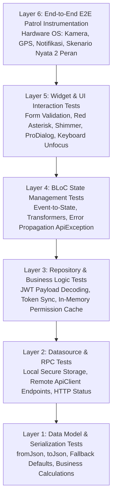
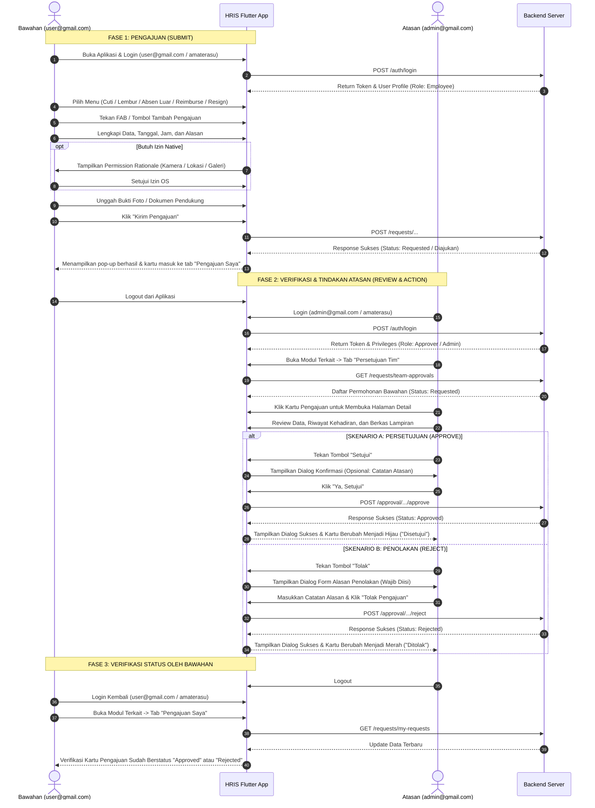

# Panduan Pengujian E2E, Flow Alur Kerja & Checklist Lengkap Menu HRIS

Dokumen ini merupakan panduan pengujian instrumentasi komprehensif (*End-to-End Testing*) menggunakan **Patrol by LeanCode** untuk aplikasi **Muratech HRIS Flutter**. Dokumen ini mencakup panduan setup native, kredensial akun uji coba, arsitektur alur kerja 2 peran (*Bawahan vs Atasan*), serta *checklist* kasus uji untuk seluruh menu dan fitur aplikasi.

---

## 1. Pendahuluan & Setup Patrol

### Mengapa Menggunakan Patrol?
Aplikasi HRIS berinteraksi langsung dengan fitur perangkat keras native:
- **Kamera**: Pengambilan foto selfie kehadiran (*Clock-in / Clock-out*), foto bukti aktivitas (*Activity Proof*), dan nota bukti pengeluaran.
- **Lokasi (GPS / Geofencing)**: Validasi radius kantor pada presensi, pelacakan koordinat aktivitas luar kantor, dan modul *Live Tracking*.
- **Galeri / Dokumen**: Pengunggahan file surat keterangan dokter dan pembacaan berkas PDF (Slip Gaji & Surat Peringatan).
- **Notifikasi Sistem OS**: Notifikasi pengingat jam masuk kerja dan persetujuan pengajuan.

Framework `integration_test` bawaan Flutter hanya dapat mengontrol elemen di dalam kanvas Flutter dan **tidak mampu berinteraksi dengan dialog perizinan sistem operasi Android / iOS** (*"Izinkan aplikasi mengakses kamera?"*). **Patrol** menjembatani Flutter ke **Android UIAutomator** dan **iOS XCUITest** sehingga otomasi native perizinan dapat berjalan secara mulus tanpa intervensi manual.

---

### Cara Menjalankan Pengujian Patrol

1. **Memastikan Perangkat Terhubung**:
   ```bash
   patrol doctor
   adb devices
   ```
2. **Menjalankan Pengujian Spesifik**:
   ```bash
   patrol test -t integration_test/patrol_sample_test.dart
   ```
3. **Menjalankan Pengujian Seluruh Skenario E2E**:
   ```bash
   patrol test
   ```
4. **Menjalankan via Android Gradle (CI/CD atau Firebase Test Lab)**:
   ```bash
   ./gradlew :app:connectedAndroidTest
   ```
5. **Menjalankan di iOS Simulator (Mac / XCUITest)**:
   ```bash
   # Cek daftar simulator iOS yang tersedia
   xcrun simctl list devices available

   # Eksekusi test di target simulator iOS
   patrol test -t integration_test/patrol_sample_test.dart --target "iPhone 16"
   ```

---

## 2. Arsitektur Piramida Pengujian & Analisis Cakupan Project (Unit s/d E2E)

Untuk menjamin keandalan sistem HRIS berstandar industri dengan beban transaksi tinggi (presensi GPS, mutasi approval, upload bukti), pengujian dibagi menjadi **6 tingkatan piramida pengujian terstruktur**:



### Rincian 6 Lapisan Pengujian:

1. **Layer 1: Data Model & Serialization Tests** (`test/**/models/`):
   - Validasi integritas deserialisasi `fromJson` dan serialisasi `toJson`.
   - Pengujian *fallback defaults* untuk field nullable/kosong.
   - Perhitungan bisnis dalam model (kalkulasi durasi lembur, selisih hari cuti, formula payroll).
2. **Layer 2: Datasource & API RPC Tests** (`test/**/datasources/`):
   - *Local Datasource*: Penyimpanan enkripsi iOS Keychain & Android EncryptedSharedPreferences via `SecureStorageService`.
   - *Remote Datasource*: Pemanggilan HTTP endpoint via `ApiClient` (parameter query, body JSON, header authorization, dan deserialisasi `ApiResponse<T>`).
3. **Layer 3: Repository & Business Logic Tests** (`test/**/repositories/`):
   - Penguraian token JWT (ekstraksi `employeeId`/`sub` dengan berbagai format base64 padding).
   - Sinkronisasi token ke memori `ApiClient.setAuthToken`.
   - Caching izin fungsional (`saveUserPermissions`) dan preferensi bahasa (`saveUserLanguage`).
   - Pemetaan error dari response gagal menjadi `ApiException(message, statusCode)`.
4. **Layer 4: BLoC State Management Tests** (`test/**/bloc/`):
   - Alur transisi state: `Initial -> Loading -> Success / Failure`.
   - Event transformer (debounce pencarian pegawai, droppable tombol submit).
   - Penanganan error API: ekstraksi pesan error asli tanpa teks statis (*zero hardcoded errors*).
5. **Layer 5: Component & Widget UI Tests** (`test/**/presentation/` atau `test/**/widgets/` & `screens/`):
   - Validasi input form: field kosong, format regex email, minimal karakter, tanggal terbalik, dan tanda bintang merah (`*`).
   - Kepatuhan widget global: `AppButton(isLoading: true)`, `AppTextField(onTapOutside: ...)`, `EmployeeInfoRow`.
   - Loading placeholder: `Shimmer` card skeleton, `CircularProgressIndicator(strokeWidth: 2.5)`.
   - Dialog & pop-up: verifikasi dialog `AppDialogUtil.showError` / `showSuccess` berbasis `pro_dialog`.
   - Hak akses dinamis: icon Bento Grid tersembunyi jika tidak diizinkan di `menus`, FAB mutasi tersembunyi jika tanpa permission.
6. **Layer 6: End-to-End (E2E) Patrol Instrumentation Tests** (`integration_test/`):
   - Interaksi perangkat keras asli (Kamera selfie, GPS geofencing, Galeri, notifikasi Android 13+).
   - Simulasi alur lengkap 2 peran: Bawahan mengajukan -> Logout -> Atasan mereview & aksi (Approve/Reject) -> Bawahan cek hasil status.

---

### Matriks Analisis Cakupan Pengujian 16 Modul Aplikasi HRIS

| Modul & Fitur | Layer 1: Models | Layer 2: Datasource | Layer 3: Repo | Layer 4: BLoC | Layer 5: Widget UI | Layer 6: E2E Patrol |
| :--- | :---: | :---: | :---: | :---: | :---: | :---: |
| **1. Autentikasi & Sesi** (`/splash`, `/login`, `/reset`) | ✅ Wajib | ✅ Wajib | ✅ Wajib | ✅ Wajib | ✅ Wajib | ✅ Wajib (`AUTH-01` s/d `07`) |
| **2. Dashboard Bento Grid** (`/dashboard`) | ✅ Wajib | ✅ Wajib | ✅ Wajib | ✅ Wajib | ✅ Wajib | ✅ Wajib (`DASH-01` s/d `05`) |
| **3. Presensi Masuk & Pulang** (`/attendance`) | ✅ Wajib | ✅ Wajib | ✅ Wajib | ✅ Wajib | ✅ Wajib | ✅ Wajib (`ATTN-01` s/d `07`) |
| **4. Log Presensi** (`/attendance-logs`) | ✅ Wajib | ✅ Wajib | ✅ Wajib | ✅ Wajib | ✅ Wajib | ✅ Wajib (`LOG-01` s/d `05`) |
| **5. Absen Luar Kantor** (`/attendance-requests`) | ✅ Wajib | ✅ Wajib | ✅ Wajib | ✅ Wajib | ✅ Wajib | ✅ Wajib (`OUT-01` s/d `05`) |
| **6. Aktivitas Kerja** (`/activity`) | ✅ Wajib | ✅ Wajib | ✅ Wajib | ✅ Wajib | ✅ Wajib | ✅ Wajib (`ACT-01` s/d `05`) |
| **7. Cuti & Izin** (`/leave`) | ✅ Wajib | ✅ Wajib | ✅ Wajib | ✅ Wajib | ✅ Wajib | ✅ Wajib (`LEV-01` s/d `06`) |
| **8. Lembur** (`/overtime`) | ✅ Wajib | ✅ Wajib | ✅ Wajib | ✅ Wajib | ✅ Wajib | ✅ Wajib (`OVT-01` s/d `05`) |
| **9. Klaim & Kasbon** (`/expenses`) | ✅ Wajib | ✅ Wajib | ✅ Wajib | ✅ Wajib | ✅ Wajib | ✅ Wajib (`EXP-01` s/d `05`) |
| **10. Direktori Pegawai** (`/employee-directory`) | ✅ Wajib | ✅ Wajib | ✅ Wajib | ✅ Wajib | ✅ Wajib | ✅ Wajib (`EMP-01` s/d `05`) |
| **11. Surat Peringatan (SP)** (`/warning-letter`) | ✅ Wajib | ✅ Wajib | ✅ Wajib | ✅ Wajib | ✅ Wajib | ✅ Wajib (`SP-01` s/d `04`) |
| **12. Jadwal Kerja** (`/work-schedule`) | ✅ Wajib | ✅ Wajib | ✅ Wajib | ✅ Wajib | ✅ Wajib | ✅ Wajib (`SCH-01` s/d `03`) |
| **13. Fasilitas & Aset** (`/assets`) | ✅ Wajib | ✅ Wajib | ✅ Wajib | ✅ Wajib | ✅ Wajib | ✅ Wajib (`AST-01` s/d `02`) |
| **14. Resign & Offboarding** (`/resignation`) | ✅ Wajib | ✅ Wajib | ✅ Wajib | ✅ Wajib | ✅ Wajib | ✅ Wajib (`RES-01` s/d `03`) |
| **15. Live Tracking** (`/live-tracking`) | ✅ Wajib | ✅ Wajib | ✅ Wajib | ✅ Wajib | ✅ Wajib | ✅ Wajib (`TRK-01` s/d `03`) |
| **16. Notifikasi & Pengaturan** (`/notifications`) | ✅ Wajib | ✅ Wajib | ✅ Wajib | ✅ Wajib | ✅ Wajib | ✅ Wajib (`NOT-01` s/d `04`) |

---

## 3. Kredensial & Peran Pengujian (Test Accounts)

Pengujian E2E pada modul-modul pengajuan menggunakan sistem **2 Peran (Bawahan & Atasan)** untuk menguji siklus lengkap dari pembuatan form, verifikasi, hingga persetujuan/penolakan:

| Peran | Email Akun | Kata Sandi | Deskripsi & Tugas Pengujian |
| :--- | :--- | :--- | :--- |
| **Bawahan (Employee)** | `user@gmail.com` | `amaterasu` | Mengajukan permohonan (Cuti, Lembur, Absen Luar, Reimburse, Resign), melakukan presensi mandiri, membuat laporan aktivitas, dan memantau tab *Pengajuan Saya*. |
| **Atasan (Superior / Approver)** | `admin@gmail.com` | `amaterasu` | Mengakses tab *Persetujuan Tim*, mereview lampiran & alasan pengajuan, mengeksekusi **Approve (Setujui)** atau **Reject (Tolak dengan Alasan)**, serta mengelola Surat Peringatan & Pencairan Kasir. |

---

## 4. Peta Alur Kerja 2 Peran (End-to-End Approval Lifecycle)

Berikut adalah diagram alur interaksi pengajuan berpasangan antara akun Bawahan dan akun Atasan:



---

## 5. Alur & Checklist Pengujian Berdasarkan Modul

---

### Modul 1: Autentikasi & Manajemen Sesi
* **Route Path**: `/splash`, `/login`, `/reset`, `/change-password`
* **Peran**: Seluruh Pengguna
* **Izin Native**: Tidak ada (Murni Email & Password)
* **Tingkatan Pengujian Piramida Modul 1**:
  - **Layer 1 (Model Unit Test)**: `LoginRequestModel` (`toJson`, `fromJson`, `withDeviceInfo`), `LoginResponseData`, `UserProfileData`.
  - **Layer 2 (Datasource Test)**: `AuthLocalDataSource` (enkripsi token & employee ID), `AuthRemoteDataSource` (`POST /api/v1/auth`, `GET /api/v1/auth/profile`, `PUT /api/v1/auth/language`).
  - **Layer 3 (Repository Test)**: `AuthRepositoryImpl` (ekstraksi JWT `employeeId`/`sub`, sinkronisasi `ApiClient.setAuthToken`, sinkronisasi permission & bahasa ke storage, pembersihan FCM saat logout).
  - **Layer 4 (BLoC Test)**: `AuthBloc` (`AuthCheckSessionRequested`, `AuthLoginSubmitted`, `AuthLogoutRequested`) dan penanganan error `ApiException`.
  - **Layer 5 (Widget UI Test)**: `LoginScreen` (validasi email/password, toggle obscure password `AUTH-05`, dialog `pro_dialog` `AUTH-04`, tombol loading, navigasi forgot password `AUTH-06`, double-tap exit), `ResetPasswordScreen`, `SplashScreenPage` (routing sesi aktif).
  - **Layer 6 (E2E Patrol Test)**: `integration_test/auth_e2e_test.dart` (otomasi alur aplikasi nyata, penanganan native dialog, login akun bawahan `AUTH-01`, login akun atasan `AUTH-02`, invalid login dialog, dan logout).
* **Alur Pengguna**:
  1. Pengguna membuka aplikasi -> Layar Splash mengecek sesi token di `flutter_secure_storage`.
  2. Jika token tidak ditemukan atau telah kedaluwarsa -> Navigasi otomatis ke `/login`.
  3. Form login menampilkan input **Email / NIK** dan **Kata Sandi** dengan toggle visibilitas password (ikon mata).
  4. Pengguna menekan tombol "Masuk" -> Sistem melakukan validasi lokal dan memanggil API `POST /auth/login`.
  5. Sesi berhasil disimpan ke penyimpanan aman -> Pengguna diarahkan ke `/dashboard`.
  6. Jika token invalid/expired di kemudian hari, interceptor API menangani HTTP 401 dan melakukan auto-logout ke login screen.

#### Checklist Uji Coba:
| ID | Skenario Uji | Tipe | Level Pengujian | Langkah Pengujian | Hasil yang Diharapkan |
| :--- | :--- | :--- | :--- | :--- | :--- |
| `AUTH-01` | Login Akun Bawahan | Positif | Widget & E2E Patrol | Input `user@gmail.com`, password `amaterasu`, klik "Masuk". | Berhasil masuk ke Dashboard dengan profil bawahan. |
| `AUTH-02` | Login Akun Atasan | Positif | Widget & E2E Patrol | Input `admin@gmail.com`, password `amaterasu`, klik "Masuk". | Berhasil masuk ke Dashboard dengan hak akses atasan/approver. |
| `AUTH-03` | Validasi Email Kosong & Invalid | Negatif | Widget & E2E Patrol | Kosongkan field email / format tanpa `@`, klik "Masuk". | Muncul pesan validasi "Email tidak boleh kosong" atau "Format email tidak valid". |
| `AUTH-04` | Kredensial Salah & API Error | Negatif | BLoC, Widget & E2E | Input email valid, password salah `salah123`, klik "Masuk". | Muncul pop-up error `AppDialogUtil.showError` dengan pesan dari API. |
| `AUTH-05` | Toggle Password Visibility | Positif | Widget & E2E Patrol | Masukkan karakter password, klik ikon mata. | Karakter berganti antara sensor titik-titik (*obscure*) dan teks polos. |
| `AUTH-06` | Lupa Kata Sandi Navigasi | Positif | Widget & E2E Patrol | Klik teks "Lupa Kata Sandi?". | Berpindah ke rute `/reset`. |
| `AUTH-07` | Auto Logout HTTP 401 & Session Clear | Edge Case | Repo, Interceptor & E2E | Simulasi pemanggilan API saat token expired di server. | Interceptor membersihkan storage dan mengarahkan kembali ke `/login`. |

---

### Modul 2: Dashboard & Quick Access Bento Grid
* **Route Path**: `/dashboard`
* **Peran**: Seluruh Pengguna (Tampilan item menu dinamis sesuai izin dari `GET /auth/menus`)
* **Izin Native**: Pengecekan status lokasi & notifikasi.
* **Tingkatan Pengujian Piramida Modul 2**:
  - **Layer 1 (Model Unit Test)**: `DashboardResponseModel` (`fromJson`, `toJson`, nested models `employeeDevice`, `todaySchedule`, `attendanceSummary`), `DashboardData` (`photoUrl`, `fullName`, `initials`, `isDayOff`), `MenuResponseModel`, `MenuItemModel`.
  - **Layer 2 (Datasource Test)**: `DashboardRemoteDataSource` (`getEmployeeDashboard` via `GET /api/v1/employee/dashboard`, `getAuthMenus` via `GET /api/v1/auth/menus`, pemetaan `ApiResponse`, penanganan error `ApiException`).
  - **Layer 3 (Repository Test)**: `DashboardRepositoryImpl` (pengambilan data dashboard, penyimpanan otomatis `employeeId` ke `SecureStorageService`, fallback error message saat API gagal, dan pembacaan daftar menu).
  - **Layer 4 (BLoC Test)**: `DashboardBloc` (`DashboardFetchRequested` initial & `isRefresh: true`, validasi `DashboardDeviceMismatch` saat deviceId berbeda/null/kosong, auto-logout mismatch, `DashboardError` saat API gagal, dan `DashboardTimerTicked` per detik).
  - **Layer 5 (Widget UI Test)**: `DashboardScreen` (shimmer loading placeholder `DASH-01`, filter menu dinamis `DASH-02`, dialog error API & retry, notifikasi unread badge, hari libur vs tanpa jadwal, forced logout dialog mismatch), `AttendanceHeroCard` (realtime clock, timezone badge, quick clock in/out), `QuickAccessGrid` (navigasi modul `DASH-03`), `LeaveBalancePreviewCard` (kuota cuti aktif vs nihil), `UpdatesFeedCard` (feed pengumuman dan navigasi detail).
  - **Layer 6 (E2E Patrol Test)**: `integration_test/dashboard_e2e_test.dart` (otomasi alur aplikasi nyata di device: pemuatan dashboard, interaksi Bento Grid, pull to refresh `DASH-04`, jam realtime `DASH-05`, dan navigasi header).
* **Alur Pengguna**:
  1. Menampilkan header profil pengguna, sapaan dinamis waktu, dan tombol bell notifikasi.
  2. Menampilkan **Hero Card Presensi**: jam server realtime, status presensi hari ini (Belum Masuk, Sudah Masuk, Sudah Pulang), dan tombol aksi cepat presensi.
  3. Menampilkan **Bento Grid Quick Access**: menampilkan modul yang berhak diakses pengguna (Aktivitas, Lembur, Izin & Cuti, Absen Luar, Presensi, Pegawai, Surat Peringatan, Jadwal Kerja, Klaim & Kasbon, Fasilitas, Resign, Live Tracking).
  4. Menampilkan kartu pratinjau **Saldo Cuti** dan linimasa pengumuman terbaru (*Updates Feed*).

#### Checklist Uji Coba:
| ID | Skenario Uji | Tipe | Level Pengujian | Status | Langkah Pengujian | Hasil yang Diharapkan |
| :--- | :--- | :--- | :--- | :---: | :--- | :--- |
| `DASH-01` | Shimmer Loading Awal | Positif | Widget & E2E Patrol | `[x] Teruji` | Buka Dashboard saat data pertama kali dimuat. | Tampil shimmer placeholder tanpa layout shift. |
| `DASH-02` | Filter Menu Dinamis Bento Grid | Positif | Widget & E2E Patrol | `[x] Teruji` | Verifikasi daftar ikon menu Bento Grid terhadap respon `GET /auth/menus`. | Menu yang tidak ada di `GET /auth/menus` disembunyikan otomatis. |
| `DASH-03` | Navigasi Item Menu Bento Grid | Positif | Widget & E2E Patrol | `[x] Teruji` | Klik salah satu ikon menu (misal: "Pegawai", "Presensi", "Aktivitas"). | Berpindah ke rute halaman tujuan yang sesuai secara instan dan dapat kembali ke Dashboard. |
| `DASH-04` | Pull to Refresh Gesture | Positif | Widget & E2E Patrol | `[x] Teruji` | Tarik layar dari atas ke bawah (*swipe down*). | Indikator refresh muncul, data dashboard dan notifikasi diperbarui tanpa layout flicker. |
| `DASH-05` | Jam Server Berjalan Realtime | Positif | BLoC, Widget & E2E Patrol | `[x] Teruji` | Amati detik dan menit pada kartu presensi. | Waktu bertambah secara presisi setiap detik mengikuti waktu server tanpa time drift. |
| `DASH-06` | Remote Datasource RPC & Deserialization | Positif & Negatif | Datasource Unit Test | `[x] Teruji` | Panggil `getEmployeeDashboard` dan `getAuthMenus` via `DashboardRemoteDataSourceImpl`. | Model ter-parse dengan benar dan melempar `ApiException` jika HTTP error. |
| `DASH-07` | Repository Data Sync & Employee ID Storage | Positif & Negatif | Repository Unit Test | `[x] Teruji` | Panggil `getDashboardData` dan `getMenus` via `DashboardRepositoryImpl`. | Mengembalikan data dashboard, menyimpan `employeeId` ke secure storage, dan melempar `ApiException` saat respon gagal. |
| `DASH-08` | Device Binding Mismatch & Security Logout | Keamanan / Negatif | BLoC & Widget | `[x] Teruji` | Akun diakses dari perangkat dengan deviceId berbeda dengan profil atau kosong. | Emit `DashboardDeviceMismatch`, auto-logout, dan tampil dialog non-dismissible. |
| `DASH-09` | Error State & Dialog Retry Feedback | Negatif | BLoC & Widget | `[x] Teruji` | Simulasi kegagalan koneksi API backend saat membuka dashboard. | Tampil in-screen error state dan dialog `AppDialogUtil.showError` dengan tombol coba lagi. |
| `DASH-10` | Notifikasi Bell Badge & Navigasi | Positif | Widget & E2E Patrol | `[x] Teruji` | Klik ikon lonceng notifikasi di app bar dashboard. | Navigasi ke `/notifications` dan badge jumlah unread ter-update. |
| `DASH-11` | Saldo Cuti & Feed Pengumuman | Positif | Widget | `[x] Teruji` | Verifikasi kartu pratinjau saldo cuti dan daftar pengumuman terbaru. | Menampilkan kuota cuti atau info belum ada kuota, serta pengumuman yang dapat di-tap menuju detail. |
| `DASH-12` | Header Quick Navigation (Jadwal & Profil) | Positif | Widget & E2E Patrol | `[x] Teruji` | Klik tombol jadwal kerja di header atau avatar profil pengguna. | Berpindah ke rute `/work-schedule` atau `/employee-detail` dan dapat kembali ke Dashboard. |

---

### Modul 3: Presensi Kehadiran Masuk & Pulang
* **Route Path**: `/attendance`, `/attendance-detail`
* **Peran**: Bawahan (Mandiri)
* **Izin Native**: **Kamera Depan (Selfie)** + **Lokasi GPS Akurat (Geofence)**
* **Alur Pengguna**:
  1. Pengguna membuka menu Presensi -> `PermissionUtil.requestAttendancePermissions` memverifikasi izin Kamera dan Lokasi.
  2. Jika dialog perizinan sistem muncul -> Patrol menangani dengan `$.platformAutomator.mobile.grantPermissionWhenInUse()`.
  3. Aplikasi mengambil koordinat GPS perangkat dan memvalidasi jarak terhadap lokasi kantor (*Geofence Radius*).
  4. **Jika di dalam radius**: Pengguna menekan tombol "Absen Masuk" -> Membuka kamera depan -> Mengambil foto selfie -> Kompresi otomatis -> Submit -> Pop-up sukses kehadiran ditampilkan.
  5. **Jika di luar radius**: Tombol menampilkan peringatan di luar radius kantor dan menyediakan opsi formulir "Laporkan Kendala Lokasi".
  6. Setelah absen masuk, tombol utama otomatis beralih menjadi "Absen Pulang".

#### Checklist Uji Coba:
| ID | Skenario Uji | Tipe | Langkah Pengujian | Hasil yang Diharapkan |
| :--- | :--- | :--- | :--- | :--- |
| `ATTN-01` | Grant Izin Kamera & GPS | Permission | Akses presensi pertama kali saat izin belum aktif. | Dialog native OS muncul dan berhasil disetujui tanpa crash. |
| `ATTN-02` | Presensi Masuk (Di Dalam Radius) | Positif | Klik "Absen Masuk", ambil selfie, konfirmasi. | Status berhasil tersimpan, dialog sukses muncul, jam masuk tercatat. |
| `ATTN-03` | Presensi Pulang (Clock Out) | Positif | Klik "Absen Pulang" setelah selesai jam kerja. | Status pulang tercatat, kartu ringkasan menampilkan total jam kerja. |
| `ATTN-04` | Peringatan di Luar Radius GPS | Negatif | Posisi koordinat GPS > radius kantor (misal: jarak 500m). | Muncul dialog error "Di Luar Radius Kantor" dengan tombol lapor kendala. |
| `ATTN-05` | Lapor Kendala Lokasi GPS | Positif | Klik "Laporkan Kendala", isi penjelasan kendala GPS, kirim. | Laporan kendala terkirim ke server beserta koordinat GPS pengguna. |
| `ATTN-06` | Pembatalan Foto Selfie | Negatif | Buka kamera untuk presensi, lalu tekan tombol kembali/batal kamera. | Aplikasi kembali ke layar presensi tanpa error atau hang. |
| `ATTN-07` | Pencegahan Double Clock-In | Negatif | Mencoba menekan tombol masuk saat status sudah clock-in. | Sistem mencegah aksi dan hanya mengizinkan clock-out. |

---

### Modul 4: Log & Riwayat Presensi
* **Route Path**: `/attendance-logs`, `/employee-attendance-logs`
* **Peran**: Bawahan (Tab "Saya") & Atasan (Tab "Tim Saya")
* **Izin Native**: Tidak ada
* **Alur Pengguna**:
  1. Membuka halaman log presensi -> Terdiri dari 2 Tab: **"Saya"** dan **"Tim Saya"**.
  2. Tab "Saya" menyajikan kalender bulanan dan daftar riwayat kehadiran per hari (Jam Masuk, Jam Pulang, Lokasi, dan Status).
  3. Badge status berwarna: Hijau (Tepat Waktu), Kuning (Terlambat), Biru (Pulang Cepat), Abu-abu (Libur/Off).
  4. Klik salah satu kartu -> Menampilkan detail kehadiran lengkap dengan foto selfie masuk & pulang serta thumbnail peta Google Maps.

#### Checklist Uji Coba:
| ID | Skenario Uji | Tipe | Langkah Pengujian | Hasil yang Diharapkan |
| :--- | :--- | :--- | :--- | :--- |
| `LOG-01` | Tampilan Log Kehadiran Pribadi | Positif | Buka tab "Saya" dengan akun `user@gmail.com`. | Daftar riwayat presensi bulan berjalan tampil terurut tanggal terbaru. |
| `LOG-02` | Navigasi Ganti Bulan | Positif | Klik pemilih bulan, pilih bulan sebelumnya. | List log ter-reload memuat data kehadiran pada bulan terpilih. |
| `LOG-03` | Buka Detail Presensi | Positif | Tap salah satu kartu riwayat kehadiran. | Membuka rute `/attendance-detail` menampilkan foto selfie & titik peta. |
| `LOG-04` | Log Tim Saya oleh Atasan | Positif | Login `admin@gmail.com`, buka tab "Tim Saya". | Tampil riwayat presensi seluruh anggota tim bawahan. |
| `LOG-05` | Filter Status Kehadiran | Positif | Pilih filter "Terlambat". | Hanya menampilkan tanggal-tanggal di mana pegawai datang terlambat. |

---

### Modul 5: Absen Luar Kantor (Outside Attendance Requests)
* **Route Path**: `/attendance-requests`, `/live-attendance`, `/schedule-attendance`, `/attendance-request-detail`
* **Peran**: 2 Peran (**Bawahan Mengajukan**, **Atasan Menyetujui/Menolak**)
* **Izin Native**: **Kamera Depan/Belakang** + **Lokasi GPS**
* **Alur Pengguna**:
  1. **Bawahan**:
     - Buka menu "Absen Luar Kantor" -> Tab "Pengajuan Saya".
     - Tekan FAB tambah pengajuan -> Pilih mode: **Live Attendance** (tugas mendadak di lapangan) atau **Schedule Attendance** (rencana dinas masa depan).
     - Mengambil foto bukti di lokasi (kamera) dan mendeteksi koordinat GPS otomatis.
     - Mengisi kolom alasan tugas luar kantor (wajib diisi bertanda `*`).
     - Submit formulir -> Pengajuan tersimpan dengan status `Diajukan` (*Requested*).
  2. **Atasan**:
     - Login `admin@gmail.com` -> Buka tab **"Persetujuan Tim"**.
     - Menggunakan filter bottom sheet terpadu (`AppRequestFilterBottomSheet`) untuk menyaring berdasarkan status/tanggal/divisi.
     - Klik kartu pengajuan bawahan -> Menampilkan foto bukti, lokasi peta GPS, dan alasan tugas.
     - **Approve**: Klik tombol "Setujui" -> Konfirmasi dialog -> Status berubah menjadi `Approved`.
     - **Reject**: Klik tombol "Tolak" -> Masukkan alasan penolakan pada dialog form -> Status berubah menjadi `Rejected`.

#### Checklist Uji Coba:
| ID | Skenario Uji | Tipe | Peran | Langkah Pengujian | Hasil yang Diharapkan |
| :--- | :--- | :--- | :--- | :--- | :--- |
| `OUT-01` | Pengajuan Live Attendance | Positif | Bawahan | Buka mode live, ambil foto bukti lapangan, isi alasan dinas, kirim. | Pengajuan sukses dan muncul di tab "Pengajuan Saya" berstatus `Diajukan`. |
| `OUT-02` | Validasi Wajib Foto Bukti | Negatif | Bawahan | Kosongkan foto bukti lapangan, coba tekan tombol kirim. | Form memblokir pengiriman dan menampilkan peringatan foto wajib diambil. |
| `OUT-03` | Approval oleh Atasan | Positif | Atasan | Login `admin@gmail.com`, buka tab "Persetujuan Tim", klik detail, pilih "Setujui". | Pengajuan berstatus `Approved` dan muncul notifikasi sukses. |
| `OUT-04` | Rejection dengan Alasan | Positif | Atasan | Klik detail pengajuan, pilih "Tolak", input alasan "Lokasi tidak sesuai jadwal", submit. | Pengajuan berstatus `Rejected` dan alasan penolakan tercatat di detail. |
| `OUT-05` | Filter Segmented Status | Positif | Atasan | Klik chip "Diajukan", lalu ganti ke "Approved". | List memperbarui data sesuai filter status yang dipilih secara responsif. |

---

### Modul 6: Aktivitas Kerja & Linimasa Tim (Activity)
* **Route Path**: `/activity`, `/create-activity`, `/create-activity-plan`, `/activity-detail`
* **Peran**: Seluruh Pengguna (Bawahan membuat aktivitas, Atasan membuat rencana & memantau feed)
* **Izin Native**: **Kamera / Galeri** + **Lokasi GPS**
* **Alur Pengguna**:
  1. **Bawahan**:
     - Buka menu Aktivitas -> Tab "Saya" -> Klik tombol "Buat Aktivitas" (`/create-activity`).
     - Memilih *Activity Type* (Meeting, Kunjungan Klien, Proyek Lapangan, dsb).
     - Mengisi nama venue / tempat dan uraian pekerjaan yang dilakukan.
     - Mengambil foto bukti kegiatan (*Start Proof Photo*) melalui kamera atau galeri.
     - GPS otomatis mendeteksi lokasi dan Mapbox melakukan reverse-geocoding alamat.
     - Kirim aktivitas -> Masuk ke feed linimasa aktivitas.
  2. **Atasan**:
     - Membuka tab "Tim Saya" -> Melihat linimasa kegiatan seluruh bawahan.
     - Memberikan apresiasi berupa Reaksi (*Like*) dan menulis Komentar diskusi pada kartu aktivitas.
     - Fitur **Buat Rencana Aktivitas** (`/create-activity-plan`): Menugaskan rencana kerja bagi bawahan tertentu untuk tanggal mendatang.

#### Checklist Uji Coba:
| ID | Skenario Uji | Tipe | Langkah Pengujian | Hasil yang Diharapkan |
| :--- | :--- | :--- | :--- | :--- |
| `ACT-01` | Buat Laporan Aktivitas | Positif | Isi jenis kegiatan, lokasi, uraian, foto bukti, lalu klik kirim. | Aktivitas berhasil diunggah dan muncul paling atas di feed "Saya". |
| `ACT-02` | Kompresi Otomatis Foto Bukti | Positif | Pilih foto ukuran besar (>3 MB) dari galeri perangkat. | Gambar dikompresi otomatis di bawah 100 KB sebelum diunggah. |
| `ACT-03` | Interaksi Like & Komentar | Positif | Atasan tap ikon jempol (like) dan mengirim teks komentar pada postingan bawahan. | Jumlah like bertambah dan komentar langsung muncul di utas diskusi. |
| `ACT-04` | Buat Rencana Kerja Tim | Positif | Atasan membuka form buat plan, memilih nama bawahan, tanggal, dan deskripsi target. | Rencana tugas tersimpan dan terkirim ke akun bawahan yang dituju. |
| `ACT-05` | Refresh Titik GPS | Positif | Tekan tombol refresh lokasi GPS pada kartu peta aktivitas. | Koordinat dan alamat venue ter-update sesuai lokasi terkini. |

---

### Modul 7: Pengajuan Cuti & Izin (Leave Management)
* **Route Path**: `/leave`, `/create-leave`, `/leave-detail`
* **Peran**: 2 Peran (**Bawahan Mengajukan**, **Atasan Menyetujui/Menolak**)
* **Izin Native**: **Galeri / Kamera** (Unggah Berkas Pendukung/Surat Dokter)
* **Alur Pengguna**:
  1. **Bawahan**:
     - Buka menu Cuti -> Menampilkan ringkasan sisa kuota cuti tahunan.
     - Klik tombol pengajuan cuti (`/create-leave`).
     - Memilih Tipe Cuti: Cuti Tahunan, Cuti Sakit, Cuti Menikah, Izin Khusus.
     - Memilih tanggal mulai dan tanggal selesai -> Sistem menghitung durasi hari kerja efektif.
     - Mengunggah surat keterangan dokter (wajib jika izin sakit > 1 hari).
     - Mengisi alasan cuti -> Submit formulir.
  2. **Atasan**:
     - Login `admin@gmail.com` -> Buka tab "Persetujuan Tim".
     - Melihat permohonan cuti bawahan beserta kalkulasi pengurangan saldo cuti.
     - Eksekusi persetujuan (**Setujui**) atau penolakan (**Tolak** dengan alasan).
     - Jika disetujui, saldo cuti bawahan otomatis terpotong di sistem.

#### Checklist Uji Coba:
| ID | Skenario Uji | Tipe | Peran | Langkah Pengujian | Hasil yang Diharapkan |
| :--- | :--- | :--- | :--- | :--- | :--- |
| `LEV-01` | Pengajuan Cuti Tahunan | Positif | Bawahan | Ajukan cuti 2 hari kerja dengan saldo mencukupi, isi alasan, submit. | Form terkirim sukses, status `Diajukan` di tab *Pengajuan Saya*. |
| `LEV-02` | Validasi Saldo Cuti Habis | Negatif | Bawahan | Ajukan cuti tahunan melebihi sisa saldo kuota yang dimiliki. | Sistem memunculkan pesan validasi saldo cuti tidak mencukupi. |
| `LEV-03` | Validasi Tanggal Terbalik | Negatif | Bawahan | Tentukan tanggal selesai lebih awal daripada tanggal mulai. | Sistem memvalidasi tanggal selesai harus sama atau setelah tanggal mulai. |
| `LEV-04` | Unggah Surat Dokter (Cuti Sakit) | Positif | Bawahan | Ajukan cuti sakit, upload foto surat dokter melalui picker card. | Berkas lampiran berhasil di-attach dan thumbnail dapat diintip. |
| `LEV-05` | Persetujuan Cuti oleh Atasan | Positif | Atasan | Login `admin@gmail.com`, buka tab tim, klik "Setujui", konfirmasi. | Status berubah menjadi `Approved`, kuota cuti bawahan berkurang. |
| `LEV-06` | Penolakan Cuti oleh Atasan | Positif | Atasan | Klik detail cuti bawahan, klik "Tolak", input alasan penolakan, submit. | Status berubah menjadi `Rejected`, kuota saldo cuti tidak terpotong. |

---

### Modul 8: Pengajuan Lembur (Overtime Management)
* **Route Path**: `/overtime`, `/create-overtime`, `/overtime-detail`
* **Peran**: 2 Peran (**Bawahan Mengajukan**, **Atasan Menyetujui/Menolak**)
* **Izin Native**: Tidak ada (Dokumen pendukung opsional)
* **Alur Pengguna**:
  1. **Bawahan**:
     - Buka menu Lembur -> Tab "Pengajuan Saya" -> Tekan tombol "Ajukan Lembur".
     - Memilih tanggal pelaksanaan lembur.
     - Menentukan Jam Mulai dan Jam Selesai -> Durasi lembur dihitung otomatis dalam format jam & menit.
     - Mengisi uraian tugas / hasil pekerjaan yang dikerjakan saat lembur.
     - Submit formulir lembur.
  2. **Atasan**:
     - Login `admin@gmail.com` -> Buka tab "Persetujuan Tim".
     - Memeriksa kesesuaian waktu lembur dan urgensi tugas yang dilaporkan.
     - Eksekusi persetujuan (**Setujui**) atau penolakan (**Tolak** dengan catatan).

#### Checklist Uji Coba:
| ID | Skenario Uji | Tipe | Peran | Langkah Pengujian | Hasil yang Diharapkan |
| :--- | :--- | :--- | :--- | :--- | :--- |
| `OVT-01` | Pengajuan Lembur Mandiri | Positif | Bawahan | Pilih tanggal, set jam 18:00 - 21:00 (3 jam), isi tugas, kirim. | Pengajuan berhasil dibuat dengan kalkulasi durasi 3 jam. |
| `OVT-02` | Validasi Jam Selesai < Jam Mulai | Negatif | Bawahan | Set jam mulai 20:00, jam selesai 19:00 pada tanggal yang sama. | Sistem menolak input dan memunculkan pesan validasi jam lembur. |
| `OVT-03` | Validasi Catatan Tugas Kosong | Negatif | Bawahan | Kosongkan deskripsi uraian tugas, coba klik tombol simpan. | Form memblokir submit dan menandai field catatan lembur wajib diisi. |
| `OVT-04` | Persetujuan Lembur oleh Atasan | Positif | Atasan | Buka tab persetujuan tim, klik kartu pengajuan, konfirmasi setujui. | Status pengajuan diperbarui menjadi `Approved`. |
| `OVT-05` | Penolakan Lembur oleh Atasan | Positif | Atasan | Buka detail lembur, klik "Tolak", masukkan alasan penolakan, kirim. | Status pengajuan diperbarui menjadi `Rejected`. |

---

### Modul 9: Klaim Biaya & Kasbon (Reimbursement & Cash Advance)
* **Route Path**: `/expenses`, `/create-reimbursement`, `/create-cash-advance`, `/reimbursement-detail`, `/cash-advance-detail`, `/disburse-action`
* **Peran**: 2 Peran (**Bawahan Mengajukan**, **Atasan & Kasir Memproses**)
* **Izin Native**: **Kamera / Galeri** (Upload Foto Nota / Kuitansi Pengeluaran)
* **Alur Pengguna**:
  1. **Bawahan**:
     - Buka menu Klaim & Kasbon -> Terdapat 2 segmen utama: **Reimbursement** dan **Kasbon**.
     - **Buat Reimbursement**: Mengisi tanggal transaksi, memilih nomor kasbon terkait (jika ada *settlement* kasbon), menambah item pengeluaran (kategori biaya, nominal Rupiah, upload foto nota/kuitansi). Total klaim diakumulasikan otomatis.
     - **Buat Kasbon**: Mengisi nominal dana yang dibutuhkan, tujuan keperluan, dan tanggal perkiraan realisasi.
  2. **Atasan & Kasir**:
     - Atasan mereview keabsahan nota dan menyetujui klaim di tab "Persetujuan Tim".
     - Bagian Kasir / Keuangan mengakses rute pencairan dana (`/disburse-action`) untuk mengeksekusi transfer/tunai dan upload bukti transfer bank.

#### Checklist Uji Coba:
| ID | Skenario Uji | Tipe | Peran | Langkah Pengujian | Hasil yang Diharapkan |
| :--- | :--- | :--- | :--- | :--- | :--- |
| `EXP-01` | Buat Klaim Reimbursement | Positif | Bawahan | Input item transportasi Rp 150.000, upload foto nota, submit. | Klaim tersimpan dengan total Rp 150.000 berstatus `Diajukan`. |
| `EXP-02` | Validasi Upload Nota Kuitansi | Negatif | Bawahan | Tambah item pengeluaran tanpa melampirkan foto nota kuitansi. | Sistem mewajibkan upload foto bukti untuk setiap baris pengeluaran. |
| `EXP-03` | Buat Permohonan Kasbon | Positif | Bawahan | Ajukan kasbon dinas luar kota Rp 1.000.000, isi keperluan, submit. | Kasbon berhasil diajukan dan menunggu persetujuan atasan. |
| `EXP-04` | Approval Klaim oleh Atasan | Positif | Atasan | Login `admin@gmail.com`, periksa nota kuitansi, setujui pengajuan. | Status klaim terverifikasi dan siap dicairkan oleh kasir. |
| `EXP-05` | Pencairan Dana oleh Kasir | Positif | Kasir | Buka `/disburse-action`, pilih metode Transfer Bank, input referensi. | Status klaim terbayarkan (*Disbursed*) dan riwayat tercatat lengkap. |

---

### Modul 10: Direktori Pegawai & Kontak Rekan Kerja
* **Route Path**: `/employee-directory`, `/employee-detail`, `/coworker-list`
* **Peran**: Seluruh Pengguna
* **Izin Native**: Tidak ada (Interaksi URL Launcher untuk Telepon, WhatsApp, dan Email)
* **Alur Pengguna**:
  1. Pengguna membuka Direktori Pegawai -> Menampilkan search bar dan filter organisasi (Perusahaan & Departemen).
  2. Daftar pegawai tersaji dengan avatar, nama lengkap, jabatan, divisi, dan status aktif.
  3. Klik salah satu pegawai -> Menampilkan halaman profil detail (Bio, Informasi Kepegawaian, dan Aksi Cepat).
  4. Tombol aksi cepat:
     - **WhatsApp**: Membuka aplikasi WhatsApp ke nomor HP pegawai.
     - **Telepon**: Membuka dialer telepon perangkat native.
     - **Email**: Membuka aplikasi email pengirim.
  5. Tombol "Lihat Rekan Satu Divisi" (`/coworker-list`): Menampilkan seluruh kolega dalam satu departemen.

#### Checklist Uji Coba:
| ID | Skenario Uji | Tipe | Langkah Pengujian | Hasil yang Diharapkan |
| :--- | :--- | :--- | :--- | :--- |
| `EMP-01` | Pencarian Pegawai Realtime | Positif | Ketik nama "Budi" atau nomor NIK di kolom pencarian. | Daftar pegawai terfilter secara instan sesuai kata kunci. |
| `EMP-02` | Filter Berdasarkan Departemen | Positif | Pilih filter divisi "Teknologi Informasi". | Hanya menampilkan pegawai yang terdaftar pada divisi IT. |
| `EMP-03` | Buka Profil Detail Pegawai | Positif | Tap salah satu item kartu pegawai. | Halaman profil detail terbuka memuat riwayat jabatan dan kontak. |
| `EMP-04` | Aksi Kontak WhatsApp | Positif | Klik tombol chat WhatsApp pada halaman detail pegawai. | Url launcher mengarahkan ke tautan `wa.me/<nomor>` dengan benar. |
| `EMP-05` | Navigasi Rekan Kerja Sekantor | Positif | Klik opsi "Rekan Kerja Satu Tim". | Berpindah ke `/coworker-list` menampilkan daftar pegawai satu departemen. |

---

### Modul 11: Surat Peringatan (Warning Letter / SP)
* **Route Path**: `/warning-letter`, `/create-warning-letter`, `/warning-letter-detail`, `/pdf-viewer`
* **Peran**: 2 Peran (**Bawahan Menerima & Membaca PDF**, **Atasan Menerbitkan SP**)
* **Izin Native**: **Penyimpanan / Berkas** (Unduh Dokumen PDF)
* **Alur Pengguna**:
  1. **Bawahan**:
     - Membuka menu Surat Peringatan -> Tab **"Surat Diterima"**.
     - Melihat daftar SP yang diterbitkan untuk dirinya beserta tingkatannya (SP 1, SP 2, SP 3).
     - Tap kartu SP -> Halaman detail menampilkan kronologi pelanggaran dan sanksi.
     - Tombol "Lihat Surat Resmi (PDF)" -> Membuka dokumen PDF resmi via in-app PDF Viewer (`/pdf-viewer`).
  2. **Atasan / HR**:
     - Membuka tab **"Diterbitkan"** -> Tombol "Terbitkan SP Baru" (`/create-warning-letter`).
     - Memilih pegawai sasaran pelanggaran.
     - Memilih Tingkat SP (Teguran Lisan, SP 1, SP 2, SP 3).
     - Mengisi uraian pasal/aturan yang dilanggar, masa berlaku SP, dan sanksi pendisiplinan.
     - Submit -> Dokumen SP resmi tersimpan dan ternotifikasi ke bawahan.

#### Checklist Uji Coba:
| ID | Skenario Uji | Tipe | Peran | Langkah Pengujian | Hasil yang Diharapkan |
| :--- | :--- | :--- | :--- | :--- | :--- |
| `SP-01` | Penerbitan SP oleh Atasan | Positif | Atasan | Pilih pegawai, pilih SP 1, uraikan pelanggaran, tentukan masa aktif, kirim. | SP berhasil diterbitkan dan masuk ke daftar surat keluar. |
| `SP-02` | Menerima & Membaca SP | Positif | Bawahan | Login `user@gmail.com`, buka tab "Surat Diterima", klik surat yang masuk. | Detail SP tampil lengkap memuat alasan penerbitan dan masa berlaku. |
| `SP-03` | In-App PDF Viewer | Positif | Bawahan | Klik tombol "Lihat Dokumen PDF" pada detail SP. | File PDF dirender secara visual di dalam aplikasi tanpa error. |
| `SP-04` | Hak Akses Pembuatan SP | Edge Case | Bawahan | Pengguna tanpa hak akses mencoba mengakses `/create-warning-letter`. | Sistem memblokir aksi atau API merespon error 403 Forbidden. |

---

### Modul 12: Jadwal Kerja Pegawai (Work Schedule)
* **Route Path**: `/work-schedule`, `/employee-schedule-select`
* **Peran**: Seluruh Pengguna
* **Izin Native**: Tidak ada
* **Alur Pengguna**:
  1. Membuka menu Jadwal Kerja -> Atasan dapat memilih jadwal bawahan (`/employee-schedule-select`) atau jadwal diri sendiri.
  2. Tampilan kalender interaktif bulanan dengan dot berwarna yang menandai jenis shift per tanggal.
  3. Klik salah satu tanggal pada kalender -> Menampilkan detail kartu shift kerja: Nama Shift (Pagi / Siang / Malam / Normal), Jam Mulai Masuk, Jam Pulang, dan Status Hari Libur Nasional.

#### Checklist Uji Coba:
| ID | Skenario Uji | Tipe | Langkah Pengujian | Hasil yang Diharapkan |
| :--- | :--- | :--- | :--- | :--- |
| `SCH-01` | Tampilan Jadwal Kerja Pribadi | Positif | Buka kalender jadwal kerja bulan ini. | Seluruh hari kerja memiliki penanda shift dengan jam operasional yang tepat. |
| `SCH-02` | Tampilan Hari Libur (Off) | Positif | Klik tanggal akhir pekan atau hari libur nasional. | Muncul status "Hari Libur" tanpa kewajiban presensi. |
| `SCH-03` | Pilihan Jadwal Bawahan | Positif | Atasan memilih nama salah satu staf bawahan di halaman seleksi. | Kalender memuat data jadwal kerja khusus staf yang dipilih. |

---

### Modul 13: Fasilitas & Aset Kantor (Assets)
* **Route Path**: `/assets`
* **Peran**: Bawahan (Melihat aset pinjaman) & Atasan
* **Izin Native**: Tidak ada
* **Alur Pengguna**:
  1. Pengguna membuka menu Fasilitas -> Memuat daftar aset inventaris perusahaan yang sedang dipinjamkan ke pegawai.
  2. Setiap kartu aset menampilkan nama perangkat (Laptop, Motor Operasional, Kartu Akses, ID Card), nomor seri / inventaris, tanggal serah terima, dan badge kondisi fisik (Bagus, Rusak Ringan, Perlu Servis).

#### Checklist Uji Coba:
| ID | Skenario Uji | Tipe | Langkah Pengujian | Hasil yang Diharapkan |
| :--- | :--- | :--- | :--- | :--- |
| `AST-01` | Daftar Aset Terdaftar | Positif | Buka menu aset dengan akun yang memiliki fasilitas kantor. | Daftar aset tampil dengan nomor seri dan status kondisi fisik yang valid. |
| `AST-02` | Empty State Tanpa Aset | Edge Case | Buka menu aset dengan akun yang belum pernah menerima fasilitas. | Tampil ilustrasi kosong ramah pengguna "Belum ada fasilitas terdaftar". |

---

### Modul 14: Pengunduran Diri & Serah Terima (Resignation & Offboarding)
* **Route Path**: `/resignation`, `/create-resignation`
* **Peran**: 2 Peran (**Bawahan Mengajukan**, **Atasan & HR Menyetujui**)
* **Izin Native**: Tidak ada (Dokumen surat resign opsional)
* **Alur Pengguna**:
  1. **Bawahan**:
     - Buka menu Resign -> Tampil hub informasi *offboarding*.
     - Klik "Ajukan Pengunduran Diri" (`/create-resignation`).
     - Memilih Tanggal Terakhir Bekerja (*Last Working Day / Notice Period 30 hari*).
     - Menuliskan alasan pengunduran diri secara detail.
     - Submit -> Tracker tahapan *offboarding* mulai aktif.
  2. **Atasan & HR**:
     - Buka tab "Persetujuan Tim" -> Memeriksa permohonan resign bawahan.
     - Checklist serah terima fasilitas kantor (Laptop, Akses Server, Aset).
     - Eksekusi persetujuan (**Setujui Resign**) atau penolakan.

#### Checklist Uji Coba:
| ID | Skenario Uji | Tipe | Peran | Langkah Pengujian | Hasil yang Diharapkan |
| :--- | :--- | :--- | :--- | :--- | :--- |
| `RES-01` | Formulir Pengajuan Resign | Positif | Bawahan | Tentukan last working day, isi alasan jelas, submit formulir. | Pengajuan sukses, linimasa tahapan offboarding berubah aktif. |
| `RES-02` | Validasi Alasan Wajib Diisi | Negatif | Bawahan | Kosongkan kolom alasan resign, coba tekan tombol kirim. | Form menandai kolom alasan wajib diisi dan mencegah submit. |
| `RES-03` | Approval Resign oleh Atasan | Positif | Atasan | Login `admin@gmail.com`, review pengajuan resign, setujui. | Status permohonan resign disetujui dan proses offboarding berlanjut ke HR. |

---

### Modul 15: Pelacakan Lapangan Realtime (Live Tracking)
* **Route Path**: `/live-tracking`
* **Peran**: Atasan / Dispatcher (Monitoring Tim Lapangan)
* **Izin Native**: **Akses Layanan Google Maps / Lokasi**
* **Alur Pengguna**:
  1. Atasan membuka menu Live Tracking -> Menampilkan peta Google Maps interaktif seluruh area operasional.
  2. Marker posisi staf lapangan ditampilkan secara dinamis dengan nama pegawai dan indikator status *online / offline*.
  3. Filter divisi / tim di bagian atas untuk menyaring grup staf tertentu.
  4. Klik marker pegawai -> Menampilkan kartu ringkasan aktivitas terakhir, sisa baterai ponsel staf, dan tombol untuk melihat jejak rute (*Route Trail*).

#### Checklist Uji Coba:
| ID | Skenario Uji | Tipe | Langkah Pengujian | Hasil yang Diharapkan |
| :--- | :--- | :--- | :--- | :--- |
| `TRK-01` | Tampilan Peta Google Maps | Positif | Buka menu Live Tracking dengan akun atasan. | Google Maps berhasil dirender dan menampilkan marker pegawai lapangan. |
| `TRK-02` | Filter Tim Lapangan | Positif | Pilih filter tim "Kurir & Logistik". | Peta hanya menampilkan marker staf yang bertugas di divisi logistik. |
| `TRK-03` | Buka Jejak Rute Pegawai | Positif | Tap salah satu marker pegawai, pilih opsi "Jejak Rute". | Garis rute perjalanan (polyline) ditampilkan di atas peta dengan koordinat akurat. |

---

### Modul 16: Notifikasi & Pengaturan
* **Route Path**: `/notifications`, `/notification-settings`, `/announcement`
* **Peran**: Seluruh Pengguna
* **Izin Native**: **Izin Push Notification OS Android 13+ (`POST_NOTIFICATIONS`)**
* **Alur Pengguna**:
  1. Klik ikon lonceng pada dashboard -> Masuk ke Pusat Notifikasi (`/notifications`).
  2. Notifikasi terkelompok berdasarkan tanggal (Hari Ini, Kemarin, Minggu Ini).
  3. Klik salah satu item notifikasi -> Otomatis menandai sebagai terbaca (*read*) dan melakukan navigasi langsung (*deep link*) ke permohonan terkait.
  4. Pengaturan Notifikasi (`/notification-settings`): Mengatur saklar jenis notifikasi yang ingin diterima (Email vs Push Notifications).

#### Checklist Uji Coba:
| ID | Skenario Uji | Tipe | Langkah Pengujian | Hasil yang Diharapkan |
| :--- | :--- | :--- | :--- | :--- |
| `NOT-01` | Izin Push Notifikasi Native | Permission | Buka aplikasi pertama kali pada Android 13+. | Dialog izin notifikasi native muncul dan ditangani via Patrol. |
| `NOT-02` | List Notifikasi Masuk | Positif | Terima notifikasi persetujuan cuti / pengumuman baru. | Notifikasi muncul di notification center dengan badge unread. |
| `NOT-03` | Deep Link dari Notifikasi | Positif | Klik notifikasi "Pengajuan Cuti Anda Disetujui". | Aplikasi langsung membuka halaman detail pengajuan cuti yang bersangkutan. |
| `NOT-04` | Pengaturan Saklar Notifikasi | Positif | Matikan toggle notifikasi email, simpan perubahan. | Pengaturan preferensi tersimpan di server dan status tersinkronisasi. |

---

## 6. Ringkasan & Petunjuk Eksekusi Otomasi

Dengan mengimplementasikan **Patrol** dan mengikuti panduan di atas:
1. Seluruh kasus native perizinan (Kamera, Lokasi GPS, Galeri) dapat diotomasi tanpa intervensi fisik.
2. Pengujian siklus hidup persetujuan dapat dijalankan berurutan:
   - Sesi 1: `user@gmail.com` -> Input Form -> Submit -> Validasi status `Requested`.
   - Sesi 2: `admin@gmail.com` -> Review Tim -> Eksekusi `Approve` atau `Reject` -> Validasi status mutasi.
3. Kerapian arsitektur kode dijamin 100% lulus static analysis linter (`flutter analyze`) dan kompatibel dengan pipeline Android Native AndroidJUnitRunner.
